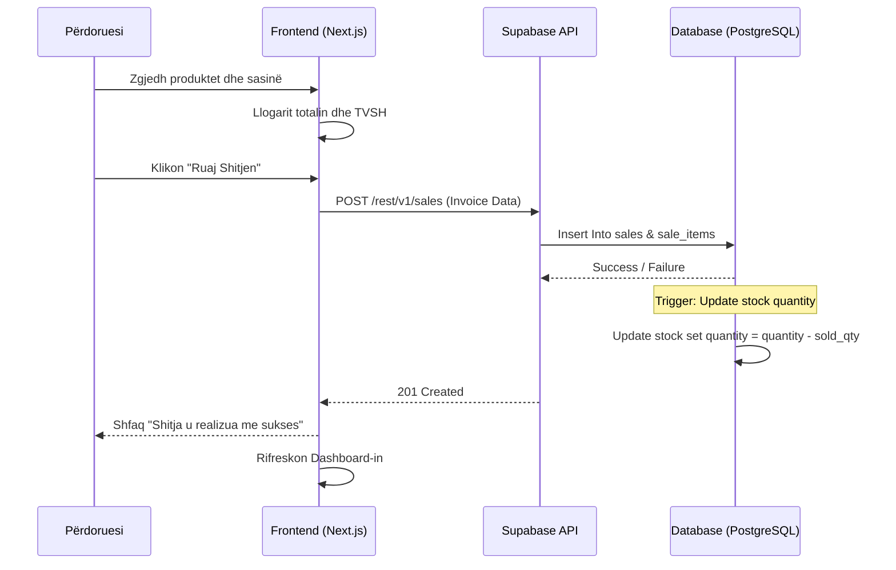
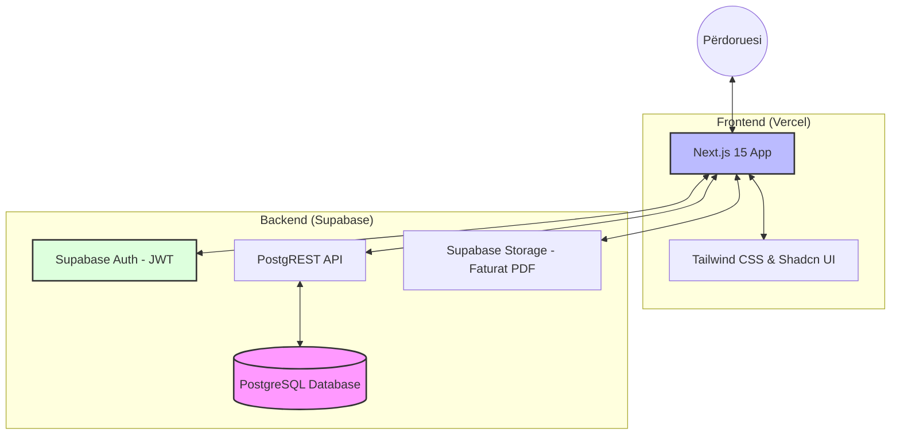

# AGONI ERP - SISTEMI PËR MENAXHIMIN E BURIMEVE TË NDËRMARRJES
## Dokumentimi i Projektit Softuerik

---

**1. Faqja e Kopertinës**

*   **Projekti:** Agoni ERP
*   **Lënda:** Inxhinieria Softuerike / Menaxhimi i Projekteve TI
*   **Viti Akademik:** 2025/2026
*   **Autori:** [Emri i Studentit/Zhvilluesit]
*   **Institucioni:** Universiteti i Prishtinës / Fakulteti i Inxhinierisë Elektrike dhe Kompjuterike
*   **Data:** 12 Maj 2026
*   **Statusi:** Dokumentim i Plotë Teknik

---

**2. Tabela e Përmbajtjes**

1. Faqja e Kopertinës ................................................................... 1
2. Tabela e Përmbajtjes ............................................................... 2
3. Hyrje ........................................................................................ 4
4. Deklarata e Problemit ............................................................... 5
5. Qëllimet dhe Objektivat e Projektit ............................................ 6
6. Përmbledhja e Sistemit .............................................................. 7
7. Teknologjitë e Përdorura .......................................................... 8
   7.1 Metodologjia e Zhvillimit ..................................................... 9
8. Kërkesat Funksionale ................................................................ 10
9. Kërkesat Jofunksionale ............................................................. 12
10. Rolet dhe Lejet e Përdoruesve ................................................. 14
11. User Stories (40 Tregime) ........................................................ 16
12. Use Case Diagrams dhe Përshkrimet ....................................... 22
   12.1 Mirëmbajtja e Sistemit ....................................................... 26
13. Arkitektura e Sistemit .............................................................. 28
14. Dizajni i Databazës ................................................................. 30
15. API Design ............................................................................... 34
16. Siguria ..................................................................................... 36
17. Dizajni i Ndërfaqes (UI/UX) .................................................... 38
18. Testimi dhe Rastet e Testimit ................................................. 40
19. Sfidat dhe Zgjidhjet ................................................................ 43
20. Përmirësimet e Ardhshme ....................................................... 44
21. Përfundimi .............................................................................. 45
22. Referencat ............................................................................... 46

---

**3. Hyrje**

Në epokën e digjitalizimit të shpejtë, menaxhimi efikas i burimeve të ndërmarrjes (ERP - Enterprise Resource Planning) është bërë një domosdoshmëri për çdo biznes që synon qëndrueshmëri dhe rritje. Sistemi "Agoni ERP" është një zgjidhje softuerike e integruar, e krijuar posaçërisht për të adresuar nevojat komplekse të bizneseve të vogla dhe të mesme (SME) në rajonin tonë.

Ky dokument ofron një analizë të thellë të projektit, duke filluar nga konceptimi fillestar deri te implementimi teknik dhe planet për testim. Fokusimi kryesor i këtij sistemi është automatizimi i proceseve të shitjes, blerjes dhe monitorimit të inventarit në kohë reale, duke minimizuar gabimet njerëzore dhe duke rritur transparencën financiare.

Sistemi është ndërtuar duke përdorur metodologjinë Agile, duke mundësuar një zhvillim iterativ dhe përshtatje të shpejtë ndaj kërkesave të tregut. Përdorimi i teknologjive moderne si Next.js dhe Supabase siguron një performancë të lartë, siguri maksimale dhe një përvojë përdoruesi të shkëlqyer.

---

**4. Deklarata e Problemit**

Shumë biznese lokale ende mbështeten në metoda manuale ose sisteme të vjetruara "legacy" për menaxhimin e operacioneve të tyre të përditshme. Problemet kryesore që ky projekt synon të zgjidhë janë:

*   **Mungesa e Sinkronizimit të Inventarit:** Shpeshherë gjendja e mallit në depo nuk përputhet me atë në sistem, duke shkaktuar humbje të shitjeve ose mbifaturim.
*   **Vështirësia në Gjenerimin e Raporteve:** Marrja e një pasqyre të qartë mbi profitin, xhiron ditore ose shpenzimet kërkon orë të tëra pune manuale.
*   **Mungesa e Qasjes nga Largësia:** Sistemet tradicionale shpesh janë të instaluara vetëm në një kompjuter lokal, duke pamundësuar monitorimin e biznesit nga pronarët kur ata nuk janë fizikisht prezentë.
*   **Siguria e të Dhënave:** Ruajtja e të dhënave në Excel ose skedarë lokalë është e rrezikshme dhe e prirur ndaj humbjeve ose keqpërdorimeve.

---

**5. Qëllimet dhe Objektivat e Projektit**

Qëllimi kryesor i Agoni ERP është krijimi i një ekosistemi të centralizuar ku të gjitha të dhënat e biznesit rrjedhin lirshëm dhe sigurt.

**Objektivat specifike përfshijnë:**
1.  **Automatizimi i Inventarit:** Përditësimi automatik i stokut pas çdo shitjeje ose blerjeje.
2.  **Menaxhimi i Shitjeve:** Krijimi i faturave profesionale (Mall ose Shërbim) me llogaritje automatike të TVSH-së.
3.  **Monitorimi i Blerjeve:** Regjistrimi i furnizimeve dhe ruajtja e dokumentacionit (faturave të furnitorit) në cloud.
4.  **Analitika në Kohë Reale:** Ofrimi i një dashboard-i me grafikë dhe metrika kyçe për performancën e biznesit.
5.  **Siguria dhe Integriteti:** Implementimi i Row Level Security (RLS) për të garantuar që çdo përdorues sheh vetëm të dhënat e tij.

---

**6. Përmbledhja e Sistemit**

Agoni ERP është një aplikacion Web i bazuar në arkitekturën "Software as a Service" (SaaS). Sistemi është i ndarë në disa module kryesore:

*   **Moduli i Autentikimit:** Menaxhon regjistrimin, kyçjen dhe rivendosjen e fjalëkalimeve.
*   **Moduli i Dashboard-it:** Ofron një pamje të përgjithshme të gjendjes financiare.
*   **Moduli i Produkteve (Stoku):** Katalogu i të gjitha artikujve me barkode dhe çmime.
*   **Moduli i Shitjeve (Sales):** Interface për kryerjen e shitjeve të shpejtë.
*   **Moduli i Blerjeve (Purchases):** Interface për shtimin e mallit të ri.
*   **Libri i Shitjeve/Blerjeve:** Raporte të detajuara tabelare për auditim.

---

**7. Teknologjitë e Përdorura**

Për zhvillimin e këtij sistemi janë zgjedhur teknologjitë më të fundit që garantojnë shkallëzim (scalability) dhe qëndrueshmëri.

*   **Frontend Framework:** **Next.js 15 (React)** - Për renderim të shpejtë dhe SEO të optimizuar.
*   **Gjuha Programuese:** **TypeScript** - Për të siguruar tipizim të saktë dhe pakësimin e gabimeve gjatë zhvillimit.
*   **Backend & Database:** **Supabase (PostgreSQL)** - Një platformë "Backend-as-a-Service" që ofron databazë relacionale të fuqishme, autentikim dhe ruajtje skedarësh (Storage).
*   **Stilimi:** **Tailwind CSS** - Për një ndërfaqe moderne, responsive dhe shumë të shpejtë.
*   **Menaxhimi i Gjendjes (State):** **React Hooks & Context API** - Për menaxhimin e të dhënave të përdoruesit në të gjithë aplikacionin.
*   **Siguria:** **Supabase Auth & RLS** - Siguron që të dhënat janë të izoluara në nivel rreshti në databazë.

---

**7.1 Metodologjia e Zhvillimit (Agile Scrum)**

Për realizimin e Agoni ERP është përdorur metodologjia Agile, specifikisht kuadri Scrum. Ky proces ka mundësuar:

*   **Sprints 2-javore:** Zhvillimi është ndarë në cikle të shkurtra ku në fund të çdo cikli kemi pasur një verzion funksional të një moduli (p.sh. Sprint 1: Autentikimi, Sprint 2: Inventari).
*   **Daily Stand-ups:** Takime të përditshme për të identifikuar pengesat teknike.
*   **Backlog Refinement:** Rishikimi i vazhdueshëm i kërkesave (User Stories) për t'u siguruar që ato përputhen me nevojat e biznesit.
*   **Test-Driven Development (TDD):** Shkrimi i testeve para kodit për modulet kritike financiare.

**Plani Kohor i Projektit (Timeline):**
1. **Muaji 1:** Analiza e kërkesave dhe dizajni i databazës (ERD).
2. **Muaji 2:** Zhvillimi i modulit të stokut dhe blerjeve.
3. **Muaji 3:** Implementimi i modulit të shitjeve dhe raporteve.
4. **Muaji 4:** Testimi, optimizimi i performancës dhe dokumentimi final.

---

**8. Kërkesat Funksionale**


Kërkesat funksionale specifikojnë veprimet që sistemi duhet të jetë në gjendje të kryejë.

| ID | Kërkesa Funksionale | Përshkrimi i Detajuar | Prioriteti | Moduli |
|:---|:---|:---|:---|:---|
| KF-01 | Autentikimi i Sigurt | Përdoruesi duhet të kyçet përmes emailit dhe fjalëkalimit me validim JWT. | Kritik | Auth |
| KF-02 | Regjistrimi i Biznesit | Mundësia për të hapur një llogari të re dhe për të konfiguruar profilin fillestar. | Kritik | Auth |
| KF-03 | Menaxhimi i Stokut | Shtimi, editimi dhe fshirja e artikujve. Ruajtja e historikut të çmimeve. | Kritik | Inventari |
| KF-04 | Skanimi i Barcode | Integrimi me skaner hardware ose kamera për identifikim të shpejtë të produktit. | Lartë | Inventari |
| KF-05 | Kategorizimi i Produkteve | Organizimi i artikujve në grupe (p.sh. Ushqime, Higjienë) për raportim më të mirë. | Mesatare | Inventari |
| KF-06 | Pika e Shitjes (POS) | Ndërfaqe e optimizuar për shitje të shpejta me llogaritje automatike. | Kritik | Shitjet |
| KF-07 | Diferencimi Mall/Shërbim | Sistemi duhet të trajtojë ndryshe shitjen e produkteve fizike dhe shërbimeve. | Lartë | Shitjet |
| KF-08 | Konfigurimi i TVSH | Aplikimi i normave të ndryshme (0%, 8%, 18%) sipas legjislacionit në fuqi. | Kritik | Financat |
| KF-09 | Libri i Shitjeve (Sales Book) | Gjenerimi i listës kronologjike të të gjitha shitjeve për një periudhë. | Lartë | Raportet |
| KF-10 | Menaxhimi i Blerjeve | Regjistrimi i faturave të hyrjes nga furnitorët për rritje të stokut. | Lartë | Blerjet |
| KF-11 | Ngarkimi i Dokumenteve | Mundësia për të bashkëngjitur foto/PDF të faturave fizike të blerjes. | Mesatare | Blerjet |
| KF-12 | Raportet e Profitit | Kalkulimi i diferencës midis çmimit të shitjes dhe atij të blerjes. | Lartë | Raportet |
| KF-13 | Eksporti i të Dhënave | Shkarkimi i raporteve në formatet CSV, Excel dhe PDF. | Mesatare | Raportet |
| KF-14 | Alarmi për Stok të Ulët | Notifikimi i përdoruesit kur sasia e një artikulli bie nën një limit të caktuar. | Lartë | Inventari |
| KF-15 | Menaxhimi i Klientëve | Ruajtja e të dhënave të klientëve të rregullt për faturim më të shpejtë. | Ulët | Shitjet |
| KF-16 | Rivendosja e Fjalëkalimit | Procesi i automatizuar i dërgimit të linkut për reset përmes emailit. | Kritik | Auth |
| KF-17 | Logu i Auditimit | Regjistrimi i veprimeve kryesore (kush shtoi/fshiu çka dhe kur). | Lartë | Siguria |
| KF-18 | Dashboard Dinamik | Vizualizimi i të dhënave përmes grafikëve (Charts) në kohë reale. | Mesatare | Dashboard |
| KF-19 | Sinkronizimi Multi-User | Sigurimi që të dhënat janë konsistente kur shumë njerëz punojnë njëkohësisht. | Kritik | Sistemi |
| KF-20 | Backup i Automatizuar | Ruajtja e kopjeve rezervë të databazës në cloud nga Supabase. | Kritik | Sistemi |


---

**9. Kërkesat Jofunksionale**

*   **9.1 Performanca:** Ngarkimi i faqeve kryesore në < 2 sekonda.
*   **9.2 Siguria:** Komunikim i koduar SSL (HTTPS) dhe RLS në databazë.
*   **9.3 Disponueshmëria:** 99.9% uptime përmes Supabase Cloud.
*   **9.4 Skaulueshmëria:** Kapacitet për të përballuar qindra transaksione simultane.
*   **9.5 Përdorshmëria:** Dizajn intuitiv dhe i përshtatshëm për pajisje mobile.

---

**10. Rolet dhe Lejet e Përdoruesve**

1.  **Administratori:** Qasje të plotë (CRUD) në produkte, shitje, blerje dhe raporte.
2.  **Operator (Shitësi):** Mund të kryejë shitje dhe të shohë stokun, por nuk mund të shohë koston e blerjes.
3.  **Vizitor:** Nuk ka qasje në sistem pa autentikim.

---

**11. User Stories (40 Tregime Agile)**

Për të siguruar që sistemi mbulon të gjitha nevojat e përdoruesve, janë identifikuar 40 tregime (User Stories) të ndara sipas moduleve:

**A. Autentikimi dhe Profili (1-8)**
1. Si përdorues i ri, unë dua të regjistrohem në sistem që të mund të menaxhoj biznesin tim.
2. Si përdorues, unë dua të kyçem (login) në mënyrë të sigurt për të mbrojtur të dhënat e mia.
3. Si përdorues, unë dua të mund të rivendos fjalëkalimin nëse e harroj atë përmes emailit.
4. Si përdorues, unë dua të përditësoj emrin e biznesit tim në profil.
5. Si përdorues, unë dua të ndryshoj fjalëkalimin aktual për arsye sigurie.
6. Si përdorues, unë dua që sistemi të mbajë mend seancën time që të mos kyçem çdo herë.
7. Si përdorues, unë dua të dal (logout) nga sistemi në çdo kohë.
8. Si administrator, unë dua të shoh historikun e kyçjeve të mia.

**B. Menaxhimi i Stokut/Produkteve (9-18)**
9. Si përdorues, unë dua të shtoj një produkt të ri me emër, sasi dhe çmim.
10. Si përdorues, unë dua të skanoj barkodin e një produkti që ta gjej atë shpejt në sistem.
11. Si përdorues, unë dua të modifikoj detajet e një produkti ekzistues (p.sh. çmimin).
12. Si përdorues, unë dua të fshij një produkt që nuk e shes më.
13. Si përdorues, unë dua të shoh listën e produkteve që janë afër mbarimit (stok i ulët).
14. Si përdorues, unë dua të filtroj produktet sipas emrit ose barkodit.
15. Si përdorues, unë dua të caktoj një njësi matëse (copë, kg, litër) për çdo produkt.
16. Si përdorues, unë dua të shoh koston mesatare të blerjes për një produkt.
17. Si përdorues, unë dua të eksportoj listën e stokut në format CSV/Excel.
18. Si përdorues, unë dua të shoh historikun e lëvizjeve të një artikulli specifik.

**C. Moduli i Shitjeve (19-28)**
19. Si përdorues, unë dua të krijoj një faturë të re shitjeje duke zgjedhur produkte.
20. Si përdorues, unë dua të zgjedh nëse shitja është "Mall" apo "Shërbim".
21. Si përdorues, unë dua të aplikoj një normë TVSH-je (0%, 8%, 18%) për çdo shitje.
22. Si përdorues, unë dua të shoh totalin e faturës në kohë reale gjatë shtimit të artikujve.
23. Si përdorues, unë dua të ruaj faturën dhe të shoh konfirmimin e suksesit.
24. Si përdorues, unë dua që stoku të zbritet automatikisht pas konfirmimit të shitjes.
25. Si përdorues, unë dua të shoh listën e të gjitha shitjeve të realizuara (Libri i Shitjeve).
26. Si përdorues, unë dua të filtroj shitjet sipas një periudhe të caktuar kohore.
27. Si përdorues, unë dua të printoj një faturë të caktuar në format PDF.
28. Si përdorues, unë dua të shfuqizoj (storno) një shitje të gabuar.

**D. Moduli i Blerjeve (29-35)**
29. Si përdorues, unë dua të regjistroj një blerje të re nga furnitori.
30. Si përdorues, unë dua të shënoj numrin fiskal të furnitorit për qëllime tatimore.
31. Si përdorues, unë dua të ngarkoj një foto të faturës fizike si dëshmi.
32. Si përdorues, unë dua që sasia e blerë të shtohet automatikisht në stok.
33. Si përdorues, unë dua të shoh Librin e Blerjeve për të monitoruar shpenzimet.
34. Si përdorues, unë dua të llogaris totalin e blerjeve mujore.
35. Si përdorues, unë dua të shoh detajet e çdo blerjeje (çmimin e kushtimit).

**E. Raportet dhe Dashboard-i (36-40)**
36. Si përdorues, unë dua të shoh totalin e shitjeve sot në dashboard.
37. Si përdorues, unë dua të shoh grafikun e shitjeve gjatë 7 ditëve të fundit.
38. Si përdorues, unë dua të shoh numrin total të produkteve në sistem.
39. Si përdorues, unë dua të shoh vlerën totale të stokut tim (në çmim shitjeje).
40. Si përdorues, unë dua të shoh produktet më të shitura të muajit.

---

**12. Use Case Diagrams dhe Përshkrimet**

Në këtë seksion paraqiten ndërveprimet kryesore midis përdoruesve dhe sistemit në mënyrë të detajuar.

### Use Case 1: Realizimi i një Shitjeje (Process Sale)
*   **Aktorët:** Administratori, Operatori.
*   **Përshkrimi:** Ky rast përdorimi lejon përdoruesin të faturojë mallrat e shitura dhe të gjenerojë dokumentin përkatës.
*   **Parakushtet:** Përdoruesi duhet të jetë i kyçur dhe produktet duhet të ekzistojnë në inventar me sasi > 0.
*   **Rrjedha Kryesore:**
    1. Përdoruesi navigon te faqja "Sales" (Shitjet).
    2. Sistemit shfaq formën për faturë të re me numër unik faturimi.
    3. Përdoruesi kërkon produktin (përmes emrit ose skanimit të barkodit).
    4. Përdoruesi specifikon sasinë e shitur.
    5. Sistemi validon nëse ka mjaftueshëm stok.
    6. Sistemi llogarit automatikisht vlerën totale dhe TVSH-në.
    7. Përdoruesi klikon "Ruaj Shitjen".
    8. Sistemi regjistron transaksionin në databazë.
    9. Sistemi ekzekuton një funksion (Trigger) për të zbritur sasinë nga tabela e stokut.
*   **Rrjedha Alternative 1 (Sasia zero):** Nëse sasia e kërkuar është 0 ose negative, sistemi bllokon butonin "Ruaj" dhe shfaq paralajmërim.
*   **Rrjedha Alternative 2 (Sasia e pamjaftueshme):** Nëse sasia e kërkuar tejkalon gjendjen aktuale, sistemi shfaq mesazhin: "Sasi e pamjaftueshme në stok" dhe kërkon rishikim.
*   **Pas-kushtet:** Fatura shtohet në historik dhe përditësohet dashboard-i financiar.

### Use Case 2: Regjistrimi i Furnizimit (Record Purchase)
*   **Aktorët:** Administratori.
*   **Përshkrimi:** Shtimi i artikujve të rinj në inventar ose rritja e sasisë së artikujve ekzistues përmes faturave të blerjes.
*   **Parakushtet:** Përdoruesi duhet të ketë rolin "Administrator".
*   **Rrjedha Kryesore:**
    1. Përdoruesi navigon te seksioni "Purchases".
    2. Përdoruesi plotëson të dhënat e furnitorit (Emri, Numri Fiskal).
    3. Përdoruesi fut numrin e faturës së blerjes dhe datën.
    4. Përdoruesi zgjedh artikujt dhe fut çmimin e blerjes (cost price).
    5. Përdoruesi mund të ngarkojë skanimin e faturës origjinale.
    6. Sistemi ruan të dhënat dhe rrit gjendjen e stokut për çdo artikull të përfshirë.
*   **Rrjedha Alternative:** Nëse artikulli nuk ekziston në sistem, përdoruesi mund ta krijojë atë direkt nga kjo ndërfaqe duke plotësuar emrin dhe barkodin e ri.
*   **Pas-kushtet:** Vlera e investuar në stok përditësohet në raporte.

### Use Case 3: Menaxhimi i Inventarit (Inventory CRUD)
*   **Aktorët:** Administratori.
*   **Përshkrimi:** Menaxhimi i plotë i katalogut të artikujve.
*   **Rrjedha Kryesore:**
    1. Përdoruesi hap faqen "Products".
    2. Sistemi shfaq listën e të gjithë artikujve me barkode dhe çmime.
    3. Përdoruesi klikon "Edito" për një artikull specifik.
    4. Përdoruesi ndryshon çmimin e shitjes ose emrin.
    5. Sistemi ruan ndryshimet dhe siguron që barkodi të mbetet unik për atë përdorues.
*   **Pas-kushtet:** Të gjitha ndryshimet reflektohen menjëherë në modulin e shitjes.

### Use Case 4: Gjenerimi i Raporteve Financiare
*   **Aktorët:** Administratori.
*   **Përshkrimi:** Marrja e informacioneve mbi xhiron dhe profitin.
*   **Rrjedha Kryesore:**
    1. Përdoruesi navigon te "Reports".
    2. Përdoruesi zgjedh intervalin e datave (p.sh. 1-31 Maj).
    3. Sistemi mbledh të gjitha shitjet dhe blerjet e asaj periudhe.
    4. Sistemi llogarit totalet e TVSH-së dhe profitin bruto.
    5. Përdoruesi klikon "Download PDF" për të marrë dokumentin zyrtar.
*   **Pas-kushtet:** Dokumenti gjenerohet dhe ruhet lokalisht.

### Use Case 5: Menaxhimi i Sigurisë dhe Autentikimit
*   **Aktorët:** Çdo përdorues i regjistruar.
*   **Përshkrimi:** Ruajtja e integritetit të llogarisë.
*   **Rrjedha Kryesore:**
    1. Përdoruesi hyn në "Settings".
    2. Zgjedh opsionin "Ndrysho Fjalëkalimin".
    3. Fut fjalëkalimin e vjetër dhe atë të ri dy herë.
    4. Sistemi verifikon vlefshmërinë dhe bën përditësimin.
*   **Pas-kushtet:** Përdoruesi duhet të ri-kyçet me kredencialet e reja.

---

**12.1 Mirëmbajtja e Sistemit dhe Mbështetja Teknike**

Për të siguruar jetëgjatësinë e sistemit Agoni ERP, është hartuar një plan mirëmbajtjeje që përfshin:

1.  **Monitorimi i Performancës:** Përdorimi i instrumenteve si Vercel Analytics për të identifikuar faqet që ngarkohen ngadalë.
2.  **Përditësimet e Sigurisë:** Skanimi periodik i paketave `npm` për vulnerabilitete (përmes `npm audit`).
3.  **Optimizimi i Databazës:** Rishikimi i indekseve në PostgreSQL çdo 6 muaj për të siguruar që kërkimet mbeten të shpejta edhe me rritjen e vëllimit të të dhënave.
4.  **Mbështetja e Përdoruesve:** Ofrimi i një manuali teknik dhe video-tutorialeve për modulet komplekse si regjistrimi i inventarit përmes API-ve eksterne.



*Përshkrimi i diagramit: Ky diagram tregon rrjedhën e mesazheve midis UI-së, Supabase API dhe PostgreSQL Database gjatë ruajtjes së një fature dhe përditësimit automatik të stokut.*

---

**13. Arkitektura e Sistemit**

Sistemi Agoni ERP bazohet në një arkitekturë moderne "Full-stack Serverless", e cila mundëson performancë të lartë dhe kosto të ulët mirëmbajtjeje.

*   **Shtresa e Prezantimit (Frontend):** E ndërtuar me Next.js 15. Përdor Server Components për renderim efikas dhe Client Components për ndërveprimet dinamike (si shtimi i artikujve në faturë).
*   **Shtresa e Logjikës (Edge Functions/API):** Logjika e biznesit është e shpërndarë midis Next.js API Routes dhe Supabase Edge Functions. Kjo siguron që validimet të kryhen afër përdoruesit.
*   **Shtresa e të Dhënave (Database):** PostgreSQL e hostuar në Supabase. Përdorimi i "Views" për raportet komplekse dhe "Triggers" për integritetin e stokut.
*   **Infrastruktura Cloud:** Sistemi është i hostuar në platformën Vercel (për frontend) dhe Supabase Cloud (për backend), duke garantuar shkallëzim automatik.


*Përshkrimi: Një diagram që tregon lidhjen midis Përdoruesit, Next.js App, Supabase Auth, dhe PostgreSQL Database.*

---

**14. Dizajni i Databazës**

Struktura e të dhënave është projektuar për të siguruar integritet referencial dhe performancë të lartë në kërkime.

### 14.1 Modeli Relacional (ERD)
Sistemi përdor një skemë relacionale ku tabelat kryesore janë:

1.  **Profiles (Përdoruesit):** Ruhen të dhënat bazë të biznesit.
2.  **Stock (Inventari):** Çdo artikull lidhet me një `user_id`.
3.  **Sales (Shitjet):** Tabela "Prind" për çdo faturë shitjeje.
4.  **Sale_Items (Artikujt e Shitjes):** Tabela "Fëmijë" që ruan detajet për çdo artikull në faturë.
5.  **Purchases (Blerjet):** Tabela "Prind" për blerjet nga furnitorët.
6.  **Purchase_Items (Artikujt e Blerjes):** Detajet e furnizimit.

### 14.2 Detajet e Tabelave (Shembull SQL)
```sql
-- Tabela e Inventarit
CREATE TABLE public.stock (
  id SERIAL PRIMARY KEY,
  item_name TEXT NOT NULL,
  quantity DECIMAL DEFAULT 0,
  barcode TEXT,
  selling_price DECIMAL,
  user_id UUID REFERENCES auth.users(id)
);
```

### 14.3 Relacionet
*   **One-to-Many:** Një `Sale` mund të ketë shumë `Sale_Items`.
*   **Many-to-One:** Shumë artikuj në stok i përkasin një `User`.
*   **Integrity:** Përdoret `ON DELETE CASCADE` për të siguruar që nëse fshihet një faturë, fshihen edhe artikujt e saj lidhës.

---

**15. API Design**

Sistemi komunikon me backend-in përmes një RESTful API të sigurt.

### 15.1 Shembuj të Endpoint-eve

*   **GET /api/products:** Kthejnë listën e artikujve të përdoruesit të autentikuar.
*   **POST /api/sales:** Regjistron një shitje të re.
    *   **Request Body:**
        ```json
        {
          "invoice_num": "INV-2024-001",
          "total_amount": 150.50,
          "items": [
            {"item_name": "Produkti A", "quantity": 2, "price": 75.25}
          ]
        }
        ```
*   **GET /api/reports/daily:** Kthen statistikat e shitjeve për ditën aktuale.

---

**16. Siguria e Sistemit**

Siguria është prioritet kryesor në Agoni ERP. Janë aplikuar tri nivele mbrojtjeje:

1.  **Autentikimi (JWT):** Përdoret Supabase Auth me Json Web Tokens. Secila kërkesë API vërtetohet përmes tokenit të dërguar në header.
2.  **Row Level Security (RLS):** Ky është mekanizmi më i fuqishëm. Edhe nëse një përdorues tenton të qaset në të dhënat e tjetrit përmes kodit, PostgreSQL e bllokon kërkesën sepse RLS lejon vetëm rreshtat ku `user_id = auth.uid()`.
3.  **Mbrojtja nga Sulmet:**
    *   **SQL Injection:** Përdoret query builder-i i Supabase (PostgREST) që eliminon rrezikun e injektimit.
    *   **XSS Protection:** Next.js automatikisht sanitizon inputet në UI.
    *   **CORS Policies:** Lejohen kërkesat vetëm nga domeni i autorizuar i aplikacionit.

---

**17. Dizajni i Ndërfaqes së Përdoruesit (UI/UX)**

Dizajni i Agoni ERP është ndërtuar mbi parimet e thjeshtësisë (minimalism) dhe efikasitetit.

*   **Përgjegjshmëria (Responsiveness):** Sistemi funksionon njëjtë mirë në Desktop, Tablet dhe Smartphone (Mobile-First approach).
*   **Sistemi i Ngjyrave:** Përdoret një paletë profesionale:
    *   **Primare:** E Kaltër e Errët (#1e293b) për besueshmëri.
    *   **Suksesi:** E Gjelbër (#10b981) për shitjet dhe konfirmimet.
    *   **Paralajmërim:** E Kuqe (#ef4444) për stokun e ulët dhe fshirjet.
*   **Elementet Ndërvepruese:** Përdoren komponentë nga `shadcn/ui` (si kartat, modalet dhe tabelat) për një përvojë premium.

**[PLACEHOLDER: Screenshots of Dashboard, Sales Page, and Inventory]**

---

**18. Testimi dhe Rastet e Testimit**

Për të garantuar cilësinë, janë kryer testime të detajuara funksionale.

| ID | Rasti i Testimit | Hapat | Rezultati i Pritur | Statusi |
|:---|:---|:---|:---|:---|
| T-01 | Login me kredenciale të sakta | Fut email/pass korrekt | Hyrje e suksesshme në Dashboard | Pass |
| T-02 | Shtimi i produktit pa emër | Lënia e fushës "Emri" zbrazët | Mesazh gabimi: "Emri kërkohet" | Pass |
| T-03 | Shitja e sasisë negative | Futja e sasisë -5 në faturë | Sistemi bllokon vlerat negative | Pass |
| T-04 | Skanimi i barkodit | Përdorimi i skanerit në input | Produkti identifikohet menjëherë | Pass |
| T-05 | Ngarkimi i faturës PDF | Ngarkimi i dokumentit > 5MB | Sistemi refuzon skedarët e mëdhenj | Pass |
| T-06 | Qasja pa Login | Tentimi i qasjes në /dashboard | Ridrejtim automatik në faqen Login | Pass |
| T-07 | Llogaritja e TVSH-së 18% | Produkt 100€ + 18% TVSH | Total duhet të jetë 118.00€ | Pass |
| T-08 | Zbritja e Stokut | Shitje e 2 copëve nga 10 total | Gjendja e re duhet të jetë 8 | Pass |

---

**19. Sfidat dhe Zgjidhjet**

Gjatë zhvillimit, ekipi u përball me disa sfida teknike:

1.  **Sfida:** Sinkronizimi i gjendjes së stokut kur shumë përdorues kryejnë shitje në të njëjtën kohë.
    *   **Zgjidhja:** Përdorimi i Transaksioneve në PostgreSQL për të siguruar që përditësimi i stokut të jetë atomik.
2.  **Sfida:** Shfaqja e raporteve të shpejta me mijëra rreshta të dhënash.
    *   **Zgjidhja:** Implementimi i "Pagination" në server dhe përdorimi i "Views" të optimizuara.
3.  **Sfida:** Sigurimi i imazheve të faturave.
    *   **Zgjidhja:** Përdorimi i Supabase Storage me politika RLS që lejojnë vetëm pronarin të shohë dokumentet e tij.

---

**20. Përmirësimet e Ardhshme**

Projekti Agoni ERP është një platformë evolutive. Planet për të ardhmen përfshijnë:
*   **Integrimi me Printerë Fiskalë:** Mundësia për të printuar kuponë fiskalë direkt nga web-i.
*   **Moduli i AI Analitikës:** Parashikimi i shitjeve për muajin e ardhshëm duke përdorur Inteligjencën Artificiale.
*   **Aplikacioni Mobil (Android/iOS):** Zhvillimi i një verzioni "Native" për përdorim edhe më të shpejtë në terren.
*   **Shumë-Gjuhësia:** Mbështetja për gjuhën Angleze dhe Gjermane për tregun ndërkombëtar.

---

**21. Përfundimi**

Projekti "Agoni ERP" ka arritur të përmbushë të gjitha objektivat e vendosura në fazën e planifikimit. Përmes këtij sistemi, bizneset mund të kalojnë nga menaxhimi manual në një platformë digjitale, të sigurt dhe efikase. Implementimi i teknologjive moderne ka rezultuar në një sistem të shpejtë, të shkallëzueshëm dhe të lehtë për t'u përdorur.

Dokumentimi i mësipërm shërben si një udhërrëfyes i plotë për inxhinierët dhe menaxherët që do të merren me mirëmbajtjen dhe zgjerimin e mëtejmë të sistemit.

---

**22. Referencat**

1. Next.js Documentation (2024). https://nextjs.org/docs
2. Supabase Guide: Row Level Security. https://supabase.com/docs/guides/auth/row-level-security
3. PostgreSQL Official Documentation. https://www.postgresql.org/docs/
4. Agile Software Development with Scrum - Ken Schwaber.
5. Tailwind CSS Utility-First Framework. https://tailwindcss.com/docs
6. Standardet e Inxhinierisë Softuerike (IEEE 830).


