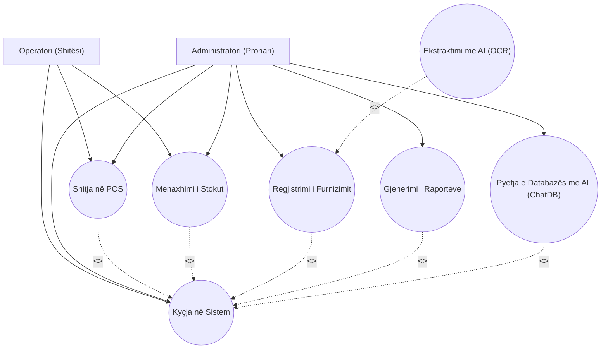
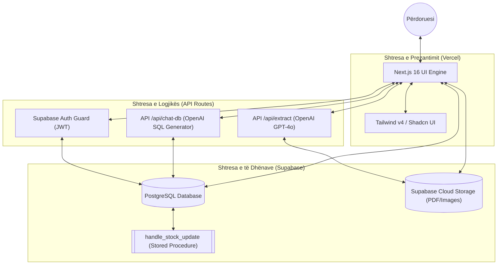
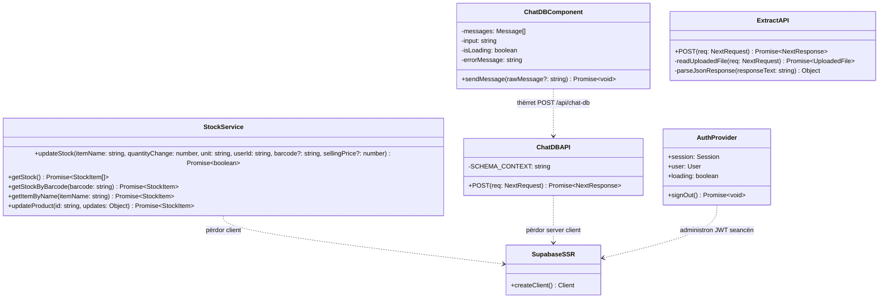
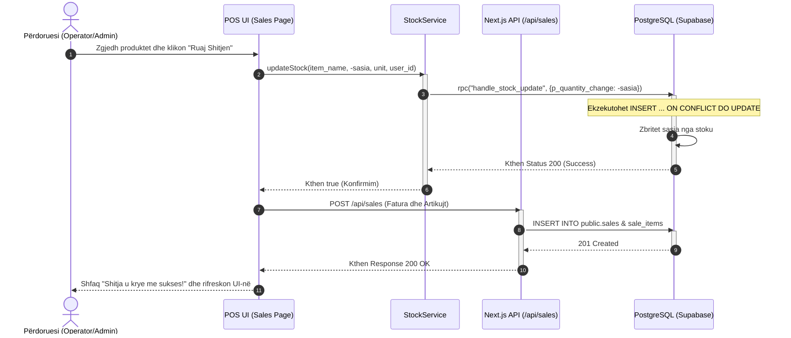
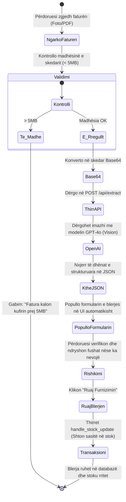
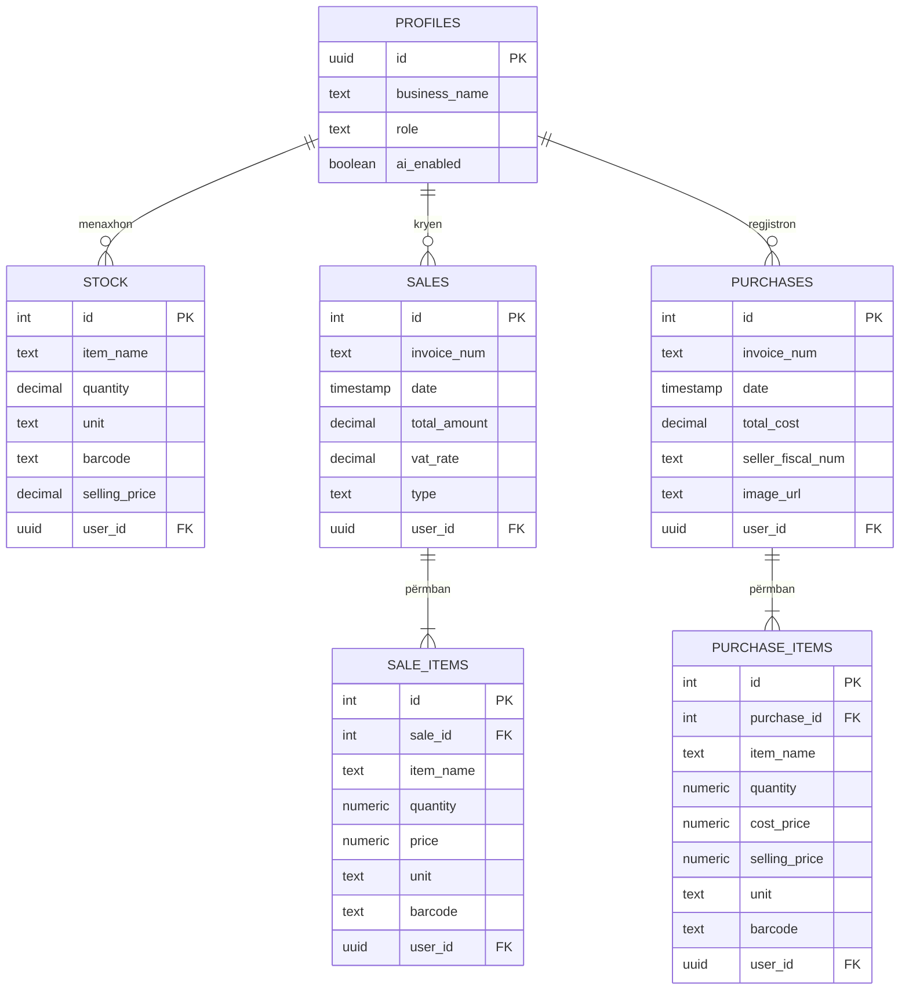

# AGONI ERP — SISTEMI I INTEGRUAR PËR MENAXHIMIN E BURIMEVE TË NDËRMARRJES
## Raport Teknik Akademik dhe Dokumentimi i Projektit Softuerik

---

### **KAPITULLI 1: Faqja Ballore & Informacioni Bazë**

<br/>

<div align="center">

**UNIVERSITETI I PRISHTINËS "HASAN PRISHTINA"**  
**FAKULTETI I INXHINIERISË ELEKTRIKE DHE KOMPJUTERIKE**  
**DEPARTAMENTI I INXHINIERISË KOMPJUTERIKE**

<br/>
<br/>
<br/>

# **AGONI ERP**
### **Sistem i Integruar dhe i Sigurt Cloud për Menaxhimin e Burimeve të Ndërmarrjeve të Vogla dhe të Mesme (SME)**

<br/>
<br/>

**Lënda:** Inxhinieria Softuerike / Menaxhimi i Projekteve TI  
**Profesor i Lëndës:** Prof. Dr. [EMRI_PROFESORIT]  
**Asistent i Lëndës:** Msc. [EMRI_ASISTENTIT]

<br/>
<br/>

**Punoi Studenti:**  
**Emri dhe Mbiemri:** [EMRI_STUDENTIT]  
**Numri i Indeksit:** [NUMRI_INDEKSIT]  
**Drejtimi:** Inxhinieri Kompjuterike & Softuerike  

<br/>
<br/>
<br/>

**Viti Akademik:** 2025/2026  
**Vendi dhe Data:** Prishtinë, 17 Maj 2026  

</div>

---

### **KAPITULLI 2: Abstrakti**

#### **Abstrakti (Shqip)**
Sistemet për Menaxhimin e Burimeve të Ndërmarrjes (ERP) janë shtylla kurrizore e operacioneve moderne të biznesit. Megjithatë, sistemet tradicionale ERP shpesh janë jashtëzakonisht komplekse, të shtrenjta për t'u implementuar dhe kërkojnë infrastrukturë të rëndë lokale. Ky projekt prezanton **Agoni ERP**, një sistem modern, "Full-Stack Serverless" dhe "Multi-Tenant" të bazuar në arkitekturën Cloud, i projektuar posaçërisht për bizneset e vogla dhe të mesme (SME). I ndërtuar me kornizën Next.js 16 (React 19), TypeScript dhe platformën Supabase (PostgreSQL), Agoni ERP ofron një mjedis të shpejtë, reaktiv dhe tejet të sigurt. 

Sistemi integron zgjidhje të avancuara të Inteligjencës Artificiale (AI): së pari, një modul për leximin dhe nxjerrjen e të dhënave automatike nga faturat fizike të blerjes përmes modelit multimodal OpenAI GPT-4o (Vision OCR), duke eliminuar nevojën për regjistrim manual; së dyti, një asistent inteligjent ndërveprues (ChatDB) i cili lejon pronarët e bizneseve të komunikojnë me bazën e tyre të të dhënave në gjuhën natyrore (shqip dhe anglisht), duke gjeneruar dhe ekzekutuar queries SQL në mënyrë të sigurt përmes procedurave të ruajtura (RPC) të databazës. Integriteti i të dhënave financiare dhe i inventarit është i garantuar përmes transaksioneve atomike në nivel të motorit PostgreSQL, duke shmangur plotësisht problemet e konkurencës (race conditions). Sistemi përfshin sigurinë e nivelit të lartë përmes Row Level Security (RLS) dhe mbështet ndërfaqe shumë-gjuhëshe për tregun rajonal dhe ndërkombëtar.

#### **Abstract (English)**
Enterprise Resource Planning (ERP) systems are the backbone of modern business operations. However, legacy ERP systems are often highly complex, prohibitively expensive, and demand heavy on-premise infrastructure. This project presents **Agoni ERP**, a state-of-the-art, "Full-Stack Serverless", "Multi-Tenant" cloud-based system specifically designed for Small and Medium Enterprises (SMEs). Built using the Next.js 16 framework (React 19), TypeScript, and the Supabase platform (PostgreSQL), Agoni ERP delivers an ultra-fast, reactive, and highly secure environment. 

The system implements advanced Artificial Intelligence (AI) components: first, an automated OCR extraction module that parses physical vendor invoices using the multimodal OpenAI GPT-4o model, converting raw image/PDF data into structured database entries instantly; second, an interactive database chatbot (ChatDB) that enables business owners to query their application data in natural language (Albanian and English), securely generating and running SQL statements via Database Stored Procedures (RPC). Financial and inventory data integrity is guaranteed using database-level atomic transactions, completely eliminating multi-user race conditions. The system ensures robust access isolation using Row Level Security (RLS) and provides full multi-language localization (Albanian and English) tailored for regional and international markets.

---

### **KAPITULLI 3: Hyrja**

#### **3.1 Konteksti dhe Motivimi i Projektit**
Bizneset e vogla dhe të mesme (SME) përbëjnë mbi 95% të ekonomisë në rajonin e Ballkanit Perëndimor. Për t'i bërë ballë konkurrencës dhe kërkesave të tregut global, digjitalizimi i operacioneve bazë — si menaxhimi i stokut, regjistrimi i blerjeve, kryerja e shitjeve dhe analizat financiare — është bërë i pashmangshëm. Motivimi prapa zhvillimit të **Agoni ERP** buron nga nevoja për një platformë të vetme, të centralizuar, që eliminon fragmentimin e të dhënave ku bizneset përdorin tabela të izoluara Excel, fatura fizike letre dhe softuerë të ndryshëm lokalë që nuk komunikojnë me njëri-tjetrin.

#### **3.2 Problemi që Zgjidhet**
Sistemi adreson drejtpërdrejt sfidat kryesore me të cilat ballafaqohen menaxherët e SME-ve sot:
1. **Gabimet në Inventar (Stock Drifts):** Regjistrimet e pakoordinuara shpesh shkaktojnë mospërputhje mes stokut fizik dhe atij në sistem. Agoni ERP e zgjidh këtë duke bërë përditësime atomike të stokut në momentin që ruhet një blerje ose shitje.
2. **Humbja e Kohës në Regjistrimin e Blerjeve:** Futja manuale e dhjetëra artikujve nga faturat e furnitorëve është e ngadaltë dhe e prirur ndaj gabimeve. Moduli AI Vision nxjerr automatikisht të dhënat brenda pak sekondave.
3. **Mungesa e Ekspertizës Teknike për Analizimin e të Dhënave:** Shumë pronarë biznesi nuk dinë të shkruajnë pyetje komplekse (queries) ose të filtrojnë raporte. Asistenti **ChatDB** u mundëson atyre të flasin direkt me databazën.
4. **Cënueshmëria e të Dhënave (Data Isolation):** Pa izolim të rreptë, të dhënat e një kompanie mund të ekspozohen ose ndryshohen nga përdorues të paautorizuar. Kjo parandalohet përmes politikave RLS të databazës.

#### **3.3 Qëllimet dhe Objektivat**
* **Krijimi i një platforme të centralizuar SaaS** ku çdo biznes ka hapësirën e vet të izoluar në databazë.
* **Zhvillimi i një pike shitjeje (POS)** intuitive dhe të shpejtë me llogaritje automatike të taksës (TVSH) për mallra dhe shërbime.
* **Integrimi i plotë i AI** për të rritur produktivitetin e ndërmarrjes përmes OCR-së së faturave dhe Chatbot-it SQL.
* **Garantimi i performancës së lartë** me kohë ngarkimi nën 2 sekonda dhe sinkronizim në kohë reale.

#### **3.4 Struktura e Raportit**
Ky raport teknik është i strukturuar në 10 kapituj. Kapitulli i parë dhe i dytë mbulojnë informacionin bazë dhe abstraktin e projektit. Kapitulli 3 prezanton motivimin dhe qëllimet. Kapitulli 4 analizon kërkesat funksionale dhe jofunksionale të sistemit duke përdorur diagramet Use Case dhe User Stories. Kapitulli 5 detajon dizajnin arkitekturor, diagramet UML (Class, Sequence, Activity, ERD) dhe dizajnin e databazës. Kapitulli 6 shpjegon procesin e implementimit teknik, strukturën e skedarëve dhe pjesët kryesore të kodit. Kapitulli 7 mbulon strategjinë dhe rastet e testimit. Kapitulli 8 përmban udhëzuesin e plotë të instalimit dhe përdorimit me përshkrime ndërfaqesh. Kapitulli 9 nxjerr konkluzionet dhe sugjeron hapat e ardhshëm, kurse Kapitulli 10 liston referencat e përdorura akademike.

---

### **KAPITULLI 4: Analiza e Kërkesave (Requirements Analysis)**

#### **4.1 Kërkesat Funksionale (KF)**
Kërkesat funksionale përshkruajnë sjelljen specifike të sistemit dhe shërbimet që ai duhet të ofrojë për përdoruesit e tij.

| ID | Kërkesa Funksionale | Përshkrimi i Detajuar | Prioriteti | Moduli |
|:---|:---|:---|:---|:---|
| **KF-01** | Autentikim me Supabase Auth | Përdoruesit duhet të regjistrohen dhe kyçen në mënyrë të sigurt duke përdorur kredencialet (Email dhe Password) të verifikuara me JWT. | Kritik | Autentikimi |
| **KF-02** | Rikuperimi i Fjalëkalimit | Mundësia për të dërguar një email për rivendosjen e fjalëkalimit të harruar. | Kritik | Autentikimi |
| **KF-03** | Menaxhimi i Profilit dhe AI | Mundësia për të aktivizuar ose çaktivizuar funksionalitetet e AI (AI Toggle) në nivel profili. | Mesatare | Administrimi |
| **KF-04** | Katalogu i Produkteve | Regjistrimi, editimi, listimi dhe fshirja e produkteve në inventar. | Kritik | Inventari |
| **KF-05** | Barkodi i Produkteve | Lidhja e çdo produkti me një kod unik barkodi për kërkim të shpejtë. | Lartë | Inventari |
| **KF-06** | Sasia dhe Njësia Matëse | Specifikimi i sasisë në stok me njësi përkatëse (copë, kg, litër, paketë, etj.). | Kritik | Inventari |
| **KF-07** | POS (Point of Sale) | Krijimi i një faturimi të shpejtë të shitjes duke zgjedhur produktet ekzistuese. | Kritik | Shitjet |
| **KF-08** | Llogaritja e TVSH-së | Aplikimi i normave të ndryshme të TVSH-së (0%, 8%, 18%) për çdo transaksion shitjeje. | Kritik | Shitjet |
| **KF-09** | Kategorizimi Mall/Shërbim | Ndarja e zërave të shitjes në mallra fizike (që ulin stokun) dhe shërbime (që nuk ndikojnë stokun). | Lartë | Shitjet |
| **KF-10** | Libri i Shitjeve | Histori e detajuar kronologjike e të gjitha shitjeve të kryera me mundësi filtrimi. | Lartë | Raportet |
| **KF-11** | Regjistrimi i Furnizimeve | Shtimi manual i blerjeve të reja me kosto blerjeje dhe çmim shitjeje. | Lartë | Blerjet |
| **KF-12** | Ekstraktimi i Faturës me AI | Ngarkimi i një fotoje/PDF të faturës fizike dhe leximi i saj automatik me AI. | Lartë | Blerjet |
| **KF-13** | Libri i Blerjeve | Histori e detajuar kronologjike e të gjitha furnizimeve dhe ruajtja e imazheve të tyre në Cloud. | Lartë | Raportet |
| **KF-14** | Dashboard-i Financiar | Pamje grafike në kohë reale e të hyrave (shitjeve), shpenzimeve (blerjeve) dhe profitit neto. | Mesatare | Dashboard |
| **KF-15** | Analitika e Stokut | Metrika mbi vlerën totale të inventarit (me çmim shitjeje) dhe totalin e artikujve. | Mesatare | Dashboard |
| **KF-16** | Asistenti ChatDB | Bisedë interaktive me AI për të marrë të dhëna nga databaza duke përdorur gjuhë natyrore. | Lartë | Asistenti AI |
| **KF-17** | Gjenerimi i SQL në ChatDB | Shfaqja dhe shpjegimi i kodit SQL të gjeneruar nga asistenti AI për transparencë. | Lartë | Asistenti AI |
| **KF-18** | Mbështetje Shumë-gjuhëshe | Mundësia për të kaluar sistemin midis gjuhës Shqipe dhe Angleze në kohë reale. | Lartë | Lokalizimi |
| **KF-19** | Ndryshimi i Temave | Mbështetja për temë të errët (Dark Mode) dhe të ndritur (Light Mode). | Ulët | UI/UX |
| **KF-20** | Eksporti i Raporteve | Mundësia e shkarkimit të raporteve në format tabular CSV/Excel. | Mesatare | Raportet |

#### **4.2 Kërkesat Jofunksionale (KJF)**
Kërkesat jofunksionale përcaktojnë kufizimet, cilësitë dhe standardet e sigurisë që sistemi duhet të plotësojë.
* **KJF-01 (Performanca):** Çdo faqe ose komponent duhet të ngarkohet në më pak se 1.5 sekonda në kushte normale rrjeti. Përpunimi i faturës me AI nuk duhet të zgjasë më shumë se 15 sekonda.
* **KJF-02 (Siguria dhe Izolimi):** Të dhënat duhet të ruhen në një databazë të mbrojtur me politika të rrepta RLS (Row Level Security). Komunikimi midis klientit dhe serverit duhet të bëhet ekskluzivisht përmes protokollit të enkriptuar HTTPS. API-të që ndërveprojnë me Supabase duhet të vërtetojnë JWT në çdo thirrje.
* **KJF-03 (Konkurenca dhe Konsistenca):** Përditësimi i sasive të stokut pas çdo blerjeje ose shitjeje duhet të jetë atomik dhe të kryhet në nivel databaze (PostgreSQL Function) për të eliminuar garat e proceseve (race conditions) kur dy operatorë punojnë njëkohësisht.
* **KJF-04 (Disponueshmëria - Uptime):** Sistemi duhet të ketë një disponueshmëri prej 99.9% duke u mbështetur në infrastrukturën Serverless të Vercel dhe Supabase Cloud.
* **KJF-05 (Përgjegjshmëria e UI - Usability):** Ndërfaqja duhet të jetë plotësisht responsive (Mobile-First) dhe të përdorë komponentë të qasshëm (Radix/Shadcn), duke u përshtatur në desktop, tableta dhe telefona celularë.

#### **4.3 UML Use Case Diagram**
Ky diagram tregon marrëdhëniet midis aktorëve kryesorë dhe rasteve kryesore të përdorimit në Agoni ERP.



#### **4.4 User Stories (40 Tregime Agile)**

##### **A. Autentikimi dhe Administrimi (1-8)**
1. **Si** përdorues i ri, **dua** të krijoj një llogari me email dhe fjalëkalim, **në mënyrë që** të kem mjedisin tim të menaxhimit të biznesit.
2. **Si** përdorues, **dua** të kyçem në llogarinë time në mënyrë të sigurt, **në mënyrë që** të parandaloj qasjen e paautorizuar në të dhënat e mia financiare.
3. **Si** përdorues, **dua** të mund të kërkoj një email për rivendosjen e fjalëkalimit, **në mënyrë që** të mund të hyj përsëri nëse e harroj atë.
4. **Si** përdorues i kyçur, **dua** të ndryshoj fjalëkalimin tim nga paneli i konfigurimit, **në mënyrë që** të mbaj llogarinë time të sigurt.
5. **Si** përdorues, **dua** që sistemi të mbajë mend seancën time (session), **në mënyrë që** të mos kem nevojë të shkruaj kredencialet çdo herë që hap faqen.
6. **Si** përdorues, **dua** të mund të dal (logout) nga sistemi në çdo kohë, **në mënyrë që** të mbroj të dhënat e mia në pajisjet e përbashkëta.
7. **Si** administrator, **dua** të aktivizoj ose çaktivizoj integrimet e AI me një buton (AI Toggle), **në mënyrë që** të kontrolloj shpenzimet e mia të API-së.
8. **Si** operator, **dua** që sistemi të më bllokojë automatikisht faqet e adminit (si blerjet dhe konfigurimet), **në mënyrë që** të mos bëj ndryshime të paautorizuara.

##### **B. Menaxhimi i Stokut (9-18)**
9. **Si** përdorues, **dua** të shtoj një produkt të ri në katalog me emër, sasi fillestare dhe njësi matëse, **në mënyrë që** ta bëj atë të disponueshëm për shitje.
10. **Si** përdorues, **dua** të caktoj një barkod për çdo produkt, **në mënyrë që** ta kërkoj atë shpejt me skaner gjatë shitjes.
11. **Si** përdorues, **dua** të editoj emrin, njësinë ose barkodin e një produkti ekzistues, **në mënyrë që** të korrigjoj gabimet e shkrimit.
12. **Si** përdorues, **dua** të fshij një produkt të gabuar nga stoku, **në mënyrë që** të mbaj katalogun tim të pastër.
13. **Si** përdorues, **dua** të specifikoj çmimin e shitjes për çdo artikull, **në mënyrë që** POS-i të llogarisë automatikisht vlerat.
14. **Si** përdorues, **dua** të shoh një listë të të gjithë artikujve të mi në formë tabele, **në mënyrë që** të bëj regjistrimin e gjendjes fizike.
15. **Si** përdorues, **dua** të kërkoj produkte duke shkruar emrin ose skanuar barkodin e tyre në tabelë, **në mënyrë që** të gjej shpejt një produkt specifik.
16. **Si** përdorues, **dua** të shoh sasinë aktuale të stokut në kohë reale, **në mënyrë që** të planifikoj blerjet e ardhshme.
17. **Si** përdorues, **dua** të shoh një tregues të stokut të ulët (Low Stock Warning), **në mënyrë që** të mos mbes kurrë pa artikuj kritikë.
18. **Si** përdorues, **dua** të shkarkoj të gjithë listën e stokut tim në format CSV, **në mënyrë që** ta importoj atë në sisteme të tjera ose ta printoj.

##### **C. POS dhe Shitjet (19-28)**
19. **Si** operator, **dua** të hap një ndërfaqe POS ku mund të zgjedh artikujt me një klikim, **në mënyrë që** të shërbej shpejt klientët.
20. **Si** operator, **dua** të llogaris automatikisht totalin e faturës ndërsa shtohen artikujt, **në mënyrë që** të parandaloj gabimet e llogaritjes manuale.
21. **Si** operator, **dua** të përzgjedh normën e TVSH-së (0%, 8%, 18%) për secilën shitje, **në mënyrë që** të jem në përputhje me ligjet tatimore.
22. **Si** operator, **dua** të përcaktoj nëse shitja është "Mall" (fizike) apo "Shërbim", **në mënyrë që** stoku të ulet vetëm për produktet fizike.
23. **Si** operator, **dua** që sistemi të kontrollojë automatikisht nëse ka mjaftueshëm stok para se të lejohet shitja, **në mënyrë që** të parandalohet stoku negativ.
24. **Si** operator, **dua** të ruaj faturën dhe të marr një numër unik faturimi kronologjik, **në mënyrë që** të regjistroj zyrtarisht shitjen.
25. **Si** përdorues, **dua** që sistemi të zbresë automatikisht sasinë e shitur nga tabela e stokut në mënyrë atomike, **në mënyrë që** stoku të mbetet i saktë.
26. **Si** përdorues, **dua** të shoh të gjitha shitjet e realizuara në Librin e Shitjeve, **në mënyrë që** të bëj auditimin ditor të arkës.
27. **Si** përdorues, **dua** të filtroj shitjet sipas periudhës kohore (ditore, javore, mujore), **në mënyrë që** të shoh ecurinë e xhiros.
28. **Si** përdorues, **dua** të shkarkoj librin e shitjeve në format CSV, **në mënyrë që** t'ia dërgoj atë kontabilistit të biznesit tim.

##### **D. Menaxhimi i Blerjeve dhe AI OCR (29-35)**
29. **Si** administrator, **dua** të regjistroj një blerje të re manuale duke plotësuar furnitorin, numrin e faturës dhe çmimet e blerjes, **në mënyrë që** të rris gjendjen e stokut.
30. **Si** administrator, **dua** të ngarkoj një imazh të faturës fizike gjatë regjistrimit, **në mënyrë që** të kem dëshmi vizuale të shpenzimit në Cloud.
31. **Si** administrator, **dua** që AI të analizojë faturën e ngarkuar dhe të plotësojë automatikisht fushat e formularit, **në mënyrë që** të kursej kohë gjatë regjistrimit të qindra artikujve.
32. **Si** administrator, **dua** që sasia e blerë e artikujve të shtohet automatikisht në stok përmes një transaksioni të sigurt, **në mënyrë që** të mos ketë gabime në kalkulim.
33. **Si** administrator, **dua** të shoh të gjitha blerjet e mia në Librin e Blerjeve, **në mënyrë që** të monitoroj shpenzimet dhe borxhet ndaj furnitorëve.
34. **Si** administrator, **dua** të shoh faturën origjinale të ngarkuar direkt nga Libri i Blerjeve me një klikim, **në mënyrë që** të verifikoj të dhënat kur ka mospërputhje.
35. **Si** administrator, **dua** të llogaris koston totale të blerjeve për çdo furnitor, **në mënyrë që** të negocioj çmime më të mira për biznesin tim.

##### **E. Dashboard-i Financiar dhe ChatDB AI (36-40)**
36. **Si** përdorues, **dua** të shoh vlerat e shitjeve, blerjeve dhe profitit të sotëm në dashboard, **në mënyrë që** të kem një pasqyrë të shpejtë të ditës.
37. **Si** përdorues, **dua** të shoh një grafik të të hyrave të 7 ditëve të fundit, **në mënyrë që** të vërej trendin e shitjeve të mia.
38. **Si** përdorues, **dua** të shoh numrin total të produkteve unike dhe vlerën totale monetare të stokut, **në mënyrë që** të di sa kapital kam të bllokuar në depo.
39. **Si** përdorues, **dua** t'i bëj pyetje në gjuhën natyrore shqipe asistentit ChatDB (p.sh. "Sa është profiti im këtë javë?"), **në mënyrë që** të marr përgjigje të shpejta pa hapur raporte komplekse.
40. **Si** përdorues, **dua** të shoh kodin SQL që ChatDB ekzekuton, **në mënyrë që** të sigurohem që rezultatet e nxjerra janë plotësisht të sakta dhe transparente.

---

### **KAPITULLI 5: Dizajni i Sistemit (System Design)**

#### **5.1 Arkitektura e Sistemit**
Agoni ERP bazohet në një arkitekturë moderne "3-Tier" (Prezantimi, Logjika dhe Të Dhënat) e cila funksionon plotësisht në mënyrë Serverless në Cloud:
1. **Shtresa e Prezantimit (Frontend):** Next.js 16 (App Router) duke përdorur React 19 Client Components, Tailwind CSS v4 për stilim dhe Shadcn UI për komponentë premium. Kjo shtresë ndërvepron me përdoruesin dhe bën kërkesa asinkrone drejt API-ve.
2. **Shtresa e Logjikës së Biznesit (Backend):** Next.js API Routes dhe Server-Side Rendered components. Përdoret korniza `@supabase/ssr` për menaxhimin e seancave përmes Cookies. Përpunimi i AI kryhet përmes integrimit të API-së së OpenAI (GPT-4o).
3. **Shtresa e të Dhënave (Database):** PostgreSQL e hostuar në Supabase Cloud. Siguria zbatohet në këtë nivel përmes politikave RLS, ndërsa integriteti atomik i transaksioneve sigurohet përmes funksioneve SQL (stored procedures).



#### **5.2 Diagramet UML**

##### **A. UML Class Diagram**
Ky diagram tregon strukturën e klasave, shërbimeve kryesore dhe ndërfaqeve të aplikacionit.



##### **B. UML Sequence Diagram (Procesi i Shitjes POS)**
Ky diagram tregon renditjen kohore të mesazheve dhe thirrjeve të realizuara kur kryhet një shitje në POS.



##### **C. UML Activity Diagram (Regjistrimi i Furnizimit me AI)**
Ky diagram përshkruan rrjedhën e aktiviteteve gjatë ngarkimit dhe ekstraktimit automatik të faturave me AI.



##### **D. UML ER Diagram (Entity-Relationship Diagram)**
Ky diagram tregon skemën e plotë të databazës, marrëdhëniet, llojet e fushave dhe çelësat e jashtëm.



#### **5.3 Dizajni i Bazës së të Dhënave (Database Schema)**

Baza e të dhënave PostgreSQL përdor 6 tabela kryesore të cilat janë të lidhura në mënyrë relacionale. Më poshtë janë paraqitur detajet për secilën tabelë.

##### **1. Tabela: `public.profiles`**
Ruhet informacioni bazë i përdoruesve të regjistruar dhe profilet e tyre të biznesit.
* **RLS Policy:** Përdoruesi mund të shohë dhe editojë vetëm profilin e tij ku `id = auth.uid()`. Administratorët mund të përditësojnë të gjitha profilet.

| Fusha (Column) | Lloji (Type) | Kufizimi (Constraint) | Përshkrimi |
|:---|:---|:---|:---|
| `id` | `uuid` | PK, References `auth.users(id)` | ID-ja unike e përdoruesit nga Supabase Auth. |
| `business_name` | `text` | NOT NULL | Emri i biznesit ose kompanisë. |
| `role` | `text` | DEFAULT 'user' | Roli i përdoruesit ('admin', 'user'). |
| `ai_enabled` | `boolean` | DEFAULT true | Tregon nëse asistentët AI janë të aktivizuar. |

##### **2. Tabela: `public.stock`**
Ruan listën e produkteve fizike në inventar për secilin biznes të izoluar.
* **Unique Constraint:** Kombinimi `(item_name, user_id)` duhet të jetë unik.
* **Indexes:** Krijohet indeks i shpejtë `idx_stock_barcode` në kolonën `barcode` për kërkime të menjëhershme.

| Fusha (Column) | Lloji (Type) | Kufizimi (Constraint) | Përshkrimi |
|:---|:---|:---|:---|
| `id` | `serial` | PK | Identifikatori unik i rreshtit. |
| `item_name` | `text` | NOT NULL | Emri i artikullit / produktit. |
| `quantity` | `decimal(12,3)` | DEFAULT 0 | Sasia aktuale në stok. Mbështet decimalet (p.sh. kg). |
| `unit` | `text` | DEFAULT 'copë' | Njësia matëse (copë, kg, litër, paketë, etj.). |
| `barcode` | `text` | NULL | Barkodi i produktit. |
| `selling_price` | `decimal(12,2)` | NULL | Çmimi standard i shitjes për njësi. |
| `user_id` | `uuid` | FK, References `auth.users(id)` | Lidhja me përdoruesin që zotëron këtë stok. |

##### **3. Tabela: `public.sales`**
Ruan kokat e faturave të shitjeve të kryera në POS.
* **Unique Constraint:** Kombinimi `(invoice_num, user_id)` duhet të jetë unik.

| Fusha (Column) | Lloji (Type) | Kufizimi (Constraint) | Përshkrimi |
|:---|:---|:---|:---|
| `id` | `serial` | PK | Identifikatori i faturës. |
| `invoice_num` | `text` | NOT NULL | Numri unik i faturës (p.sh. INV-0001). |
| `date` | `timestamp` | DEFAULT now() | Data dhe ora e realizimit të shitjes. |
| `total_amount` | `decimal(12,2)` | NOT NULL | Vlera totale e shitjes (përfshirë TVSH). |
| `vat_rate` | `decimal(5,2)` | DEFAULT 0 | Norma e TVSH-së e aplikuar në faturë. |
| `type` | `text` | CHECK ('Mall', 'Shërbim') | Lloji i transaksionit (me ndikim në stok ose jo). |
| `user_id` | `uuid` | FK, References `auth.users(id)` | ID-ja e operatorit ose adminit që bëri shitjen. |

##### **4. Tabela: `public.sale_items`**
Ruan detajet specifike (rreshtat) e secilës faturë shitjeje.
* **Delete Cascade:** Nëse fshihet fatura prind në tabelën `sales`, të gjithë rreshtat përkatës në `sale_items` fshihen automatikisht.

| Fusha (Column) | Lloji (Type) | Kufizimi (Constraint) | Përshkrimi |
|:---|:---|:---|:---|
| `id` | `serial` | PK | Identifikatori i rreshtit. |
| `sale_id` | `integer` | FK, References `sales(id) ON DELETE CASCADE` | Lidhja me faturën e shitjes prind. |
| `item_name` | `text` | NOT NULL | Emri i produktit ose shërbimit të shitur. |
| `quantity` | `numeric` | NOT NULL | Sasia e shitur. |
| `price` | `numeric` | NOT NULL | Çmimi i shitjes për njësi. |
| `unit` | `text` | NULL | Njësia matëse. |
| `barcode` | `text` | NULL | Barkodi i artikullit. |
| `user_id` | `uuid` | FK, References `auth.users(id)` | Përputhshmëria me ID-në e pronarit për RLS. |

##### **5. Tabela: `public.purchases`**
Ruan kokat e faturave të furnizimeve (blerjeve) të regjistruara nga furnitorët.

| Fusha (Column) | Lloji (Type) | Kufizimi (Constraint) | Përshkrimi |
|:---|:---|:---|:---|
| `id` | `serial` | PK | Identifikatori i blerjes. |
| `invoice_num` | `text` | NOT NULL | Numri i faturës së furnitorit. |
| `date` | `timestamp` | DEFAULT now() | Data e regjistrimit ose data e faturës fizike. |
| `total_cost` | `decimal(12,2)` | NOT NULL | Vlera totale e blerjes. |
| `seller_fiscal_num` | `text` | NULL | Numri fiskal i furnitorit (biznesit tjetër). |
| `image_url` | `text` | NULL | Linku i imazhit të faturës fizike të ruajtur në Cloud Storage. |
| `user_id` | `uuid` | FK, References `auth.users(id)` | ID-ja e administratorit që regjistroi blerjen. |

##### **6. Tabela: `public.purchase_items`**
Ruan rreshtat e detajuar për secilën blerje të kryer.

| Fusha (Column) | Lloji (Type) | Kufizimi (Constraint) | Përshkrimi |
|:---|:---|:---|:---|
| `id` | `serial` | PK | Identifikatori i rreshtit. |
| `purchase_id` | `integer` | FK, References `purchases(id) ON DELETE CASCADE` | Lidhja me blerjen prind. |
| `item_name` | `text` | NOT NULL | Emri i produktit të blerë. |
| `quantity` | `numeric` | NOT NULL | Sasia e blerë. |
| `cost_price` | `numeric` | NOT NULL | Çmimi i blerjes (kushtimit) për njësi. |
| `selling_price` | `numeric` | NULL | Çmimi i ri i shitjes i sugjeruar. |
| `unit` | `text` | NULL | Njësia matëse. |
| `barcode` | `text` | NULL | Barkodi i artikullit. |
| `user_id` | `uuid` | FK, References `auth.users(id)` | ID-ja e pronarit të të dhënave për RLS. |

---

### **KAPITULLI 6: Implementimi (Implementation)**

#### **6.1 Teknologjitë dhe Gjuhët e Programimit**
Sistemi është ndërtuar duke kombinuar mjetet më moderne për zhvillimin e shpejtë dhe të sigurt në Web:
* **Next.js 16 (React 19):** Kornizë kryesore që përdor App Router për qasje efikase në Server Components, duke minimizuar JavaScript-in që dërgohet te klienti.
* **TypeScript 5:** Gjuha e përdorur për zhvillim që mundëson tipizim statik, zvogëlon gabimet e kodimit në minimum dhe garanton cilësi të lartë kodi.
* **Tailwind CSS v4 & Shadcn UI:** Përdoren për dizajnimin e ndërfaqes. Shadcn ofron komponentë të plotë të ndërtuar mbi Radix UI, ndërsa Tailwind v4 lehtëson stilimin me shpejtësi të lartë.
* **Supabase (PostgreSQL, Auth, Storage):** Shërben si backend i plotë. Databaza PostgreSQL është e fuqishme, Supabase Auth ofron seanca JWT, ndërsa Supabase Storage ruan imazhet e faturave.
* **OpenAI API (GPT-4o):** Modeli i përdorur për analizimin multimodal të faturave (OCR) dhe përkthimin e gjuhës natyrore në queries SQL.

#### **6.2 Struktura e Foldereve dhe Moduleve**
Aplikacioni është i ndarë në module të qarta duke ndjekur strukturën standarde të Next.js App Router:

```text
agoni -programim/
├── .env.local             # Çelësat e konfigurimit të sigurisë lokale (Supabase, OpenAI)
├── package.json           # Lista e librarive dhe varësive të projektit
├── tsconfig.json          # Konfigurimi i TypeScript
├── supabase/              # Skenarët e bazës së të dhënave SQL
│   ├── schema.sql         # Skema bazë e tabelave dhe RLS
│   ├── stock_function.sql # Funksioni atomik për përditësimin e stokut
│   └── add_items_tables.sql # Krijimi i tabelave të detajuara të artikujve
├── src/
│   ├── app/               # Folderi kryesor i App Router (Faqet dhe API)
│   │   ├── layout.tsx     # Layout-i global i faqes
│   │   ├── page.tsx       # Faqja hyrëse publike (Landing Page)
│   │   ├── login/         # Ndërfaqja e kyçjes së përdoruesve
│   │   ├── register/      # Regjistrimi i bizneseve të reja
│   │   ├── admin/         # Paneli i kontrollit për administratorin
│   │   ├── api/           # API Endpoints
│   │   │   ├── chat-db/   # Endpoint-i i asistentit ChatDB (SQL Runner)
│   │   │   └── extract/   # Endpoint-i i OCR-së së faturave me AI
│   │   └── dashboard/     # Modulet e Dashboard-it të kyçur
│   │       ├── page.tsx   # Dashboard kryesor (Statistikat, Grafikët)
│   │       ├── products/  # Menaxhimi i katalogut të produkteve
│   │       ├── sales/     # POS - Kryerja e shitjeve
│   │       ├── sales-book/# Libri i shitjeve (Raportet)
│   │       ├── purchases/ # Regjistrimi i furnizimeve (Manual / AI)
│   │       └── purchases-book/# Libri i blerjeve (Raportet)
│   ├── components/        # Komponentët e ripërdorshëm React
│   │   ├── ChatDB.tsx     # Komponenti vizual i bisedës me AI
│   │   ├── EmptyState.tsx # Pamja kur tabelat nuk kanë të dhëna
│   │   └── ui/            # Komponentët Shadcn (Button, Card, Input, etc.)
│   ├── lib/               # Libraritë dhe shërbimet e centralizuara
│   │   ├── services/
│   │   │   └── stock.ts   # StockService (Shtresa e shërbimit të stokut)
│   │   └── utils.ts       # Funksione ndihmëse (p.sh. bashkimi i klasave CSS)
│   └── utils/
│       └── supabase/
│           ├── client.ts  # Supabase client për Client Components
│           ├── server.ts  # Supabase client për Server Components (SSR)
│           └── middleware.ts # Mbrojtja e rrugëve (Protected Routes) me Middleware
```

#### **6.3 Shpjegim i Pjesëve Kryesore të Kodit**

##### **1. Shtresa e Shërbimit të Stokut (StockService) — [stock.ts](file:///c:/Users/Admin/Desktop/agoni%20-programim/src/lib/services/stock.ts)**
Kjo klasë shërben si një ndërfaqe e unifikuar për kryerjen e veprimeve mbi tabelën `stock`, duke izoluar logjikën e UI-së nga databaza direkte.

```typescript
export const StockService = {
  // Përditëson stokun për një produkt në mënyrë atomike duke thirrur RPC-në PostgreSQL
  async updateStock(itemName: string, quantityChange: number, unit: string, userId: string, barcode?: string, sellingPrice?: number) {
    const supabase = createClient()
    
    // Thirrja e funksionit 'handle_stock_update' të definuar në SQL
    const { error } = await supabase.rpc('handle_stock_update', {
      p_item_name: itemName,
      p_quantity_change: quantityChange,
      p_unit: unit,
      p_user_id: userId,
      p_barcode: barcode || null,
      p_selling_price: sellingPrice || null
    })

    if (error) {
      console.error('StockService.updateStock error:', error)
      throw new Error(`Dështoi përditësimi i stokut për ${itemName}: ${error.message}`)
    }
    return true
  },

  // Merr të gjithë stokun e pronarit të autentikuar
  async getStock() {
    const supabase = createClient()
    const { data, error } = await supabase
      .from("stock")
      .select("*")
      .order("item_name", { ascending: true })

    if (error) throw error
    return data || []
  }
}
```

##### **2. Asistenti AI ChatDB (Gjeneruesi dhe Ekzekutuesi i SQL) — [route.ts](file:///c:/Users/Admin/Desktop/agoni%20-programim/src/app/api/chat-db/route.ts)**
Ky endpoint merr pyetjen e përdoruesit në gjuhë natyrore, përdor OpenAI GPT-4o me një kontekst të detajuar të skemës së databazës sonë për të krijuar një query të saktë SQL, e ekzekuton atë në mënyrë të sigurt dhe kthen të dhënat.

```typescript
// Pjesë nga SCHEMA_CONTEXT ku udhëzohet modeli AI
const SCHEMA_CONTEXT = `
Baza e te dhenave:
1. sales (invoice_num, total_amount, vat_rate, type, user_id)
2. purchases (invoice_num, total_cost, seller_fiscal_num, user_id)
3. stock (item_name, quantity, unit, barcode, selling_price, user_id)
Response format:
You must return ONLY a JSON object:
{
  "type": "sql" | "explanation",
  "sql": "A valid PostgreSQL query targeting the caller's user_id without semicolon",
  "content": "Friendly explanation of results in Albanian or English matching user language."
}
`;

export async function POST(req: NextRequest) {
  try {
    const { message } = await req.json();
    const supabase = await createClient();
    
    // Verifikojmë seancën e përdoruesit
    const { data: { user } } = await supabase.auth.getUser();
    if (!user) return NextResponse.json({ error: "I paautentikuar" }, { status: 401 });

    const apiKey = process.env.OPENAI_API_KEY;
    // Thirrja e OpenAI
    const response = await fetch("https://api.openai.com/v1/chat/completions", {
      method: "POST",
      headers: { "Authorization": `Bearer ${apiKey}`, "Content-Type": "application/json" },
      body: JSON.stringify({
        model: "gpt-4o",
        messages: [{ role: "system", content: SCHEMA_CONTEXT }, { role: "user", content: message }],
      })
    });

    const aiData = await response.json();
    const rawContent = aiData.choices?.[0]?.message?.content?.trim();
    const aiResponse = JSON.parse(rawContent);

    // Ekzekutimi i sigurt në databazë përmes stored procedure 'execute_sql'
    if (aiResponse.type === "sql" && aiResponse.sql) {
      const { data, error } = await supabase.rpc("execute_sql", { query: aiResponse.sql });
      if (error) return NextResponse.json({ error: error.message, sql: aiResponse.sql }, { status: 400 });
      return NextResponse.json({ data, sql: aiResponse.sql, content: aiResponse.content });
    }
    return NextResponse.json({ content: aiResponse.content });
  } catch (err) {
    return NextResponse.json({ error: "Gabim i brendshëm" }, { status: 500 });
  }
}
```

##### **3. Funksioni Atomik i Stokut (PostgreSQL Stored Procedure) — [stock_function.sql](file:///c:/Users/Admin/Desktop/agoni%20-programim/supabase/stock_function.sql)**
Ky funksion ekzekutohet brenda motorit të databazës PostgreSQL në mënyrë transaksionale. Ai zgjidh plotësisht mospërputhjet e sasive kur dy përdorues përpiqen të bëjnë përditësime në të njëjtin produkt në të njëjtin sekondë.

```sql
create or replace function public.handle_stock_update(
  p_item_name text,
  p_quantity_change numeric,
  p_unit text,
  p_user_id uuid,
  p_barcode text default null,
  p_selling_price numeric default null
)
returns void
language plpgsql
security definer -- Ekzekutohet me lejet e krijuesit për të garantuar shkrimin e sigurt
as $$
begin
  -- Përdoret struktura UPSERT (INSERT ... ON CONFLICT DO UPDATE)
  insert into public.stock (item_name, quantity, unit, user_id, barcode, selling_price)
  values (p_item_name, p_quantity_change, p_unit, p_user_id, p_barcode, p_selling_price)
  on conflict (item_name, user_id)
  do update set
    quantity = public.stock.quantity + excluded.quantity,
    unit = excluded.unit,
    barcode = coalesce(excluded.barcode, public.stock.barcode),
    selling_price = coalesce(excluded.selling_price, public.stock.selling_price);
end;
$$;
```

#### **6.4 Sfidat Teknike dhe Zgjidhjet e Implementuara**

##### **1. Sfida: Garat e Proceseve (Race Conditions) në Përditësimin e Stokut**
* *Përshkrimi:* Fillimisht, përditësimi i stokut bëhej duke lexuar sasinë aktuale në frontend përmes një fetch, duke llogaritur sasinë e re (Sasia e vjetër + ndryshimi) dhe duke dërguar një update drejt Supabase. Nëse përdoruesi klikonte shpejt dy herë butonin "Ruaj Shitjen", ose nëse dy përdorues shisnin të njëjtin produkt njëkohësisht, njëri nga përditësimet mbishkruhej, duke shkaktuar humbje të dhënash të sakta.
* *Zgjidhja:* Kjo u zgjidh duke eliminuar plotësisht llogaritjen e sasive nga frontend-i. U krijua funksioni SQL `handle_stock_update` (Stored Procedure) i cili ekzekuton një thirrje atomike `UPDATE stock SET quantity = quantity + p_quantity_change` brenda një transaksioni PostgreSQL. Kjo garanton që operacionet renditen në mënyrë strikte të njëpasnjëshme në server.

##### **2. Sfida: Sinkronizimi i Cookies në Next.js Server Components dhe SSR**
* *Përshkrimi:* Me përdorimin e Next.js App Router, faqet renderoren në server. Kur një përdorues kyçet, tokeni i tij JWT duhet të ruhet në Cookies që serveri të mund të dijë cilat të dhëna të shfaqë para se faqja të dërgohet te klienti. Klienti standard i Supabase në JavaScript i ruan tokenat në LocalStorage, gjë që nuk është e lexueshme nga Server Components.
* *Zgjidhja:* U integrua korniza zyrtare `@supabase/ssr` e cila zëvendëson menaxhimin e sesionit. Përmes një middleware të Next.js (`middleware.ts`), ne kapim çdo kërkesë, lexojmë Cookies e vërtetimit të Supabase, rifreskojmë tokenat nëse kanë skaduar dhe i dërgojmë ato si në Server Components ashtu edhe në Client Components, duke mbajtur një seancë plotësisht të qëndrueshme.

##### **3. Sfida: Leximi i Saktë i Faturave në Gjuhën Shqipe me AI**
* *Përshkrimi:* Faturat fizike në Kosovë dhe Shqipëri shpesh kanë formate jostandarde, përdorin shkurtesa specifike (p.sh. "Cope", "Kg", "Ltr") dhe përmbajnë terma si "Numri Fiskal", "NUI" ose "TVSH". Modelet e thjeshta OCR shpesh dështonin t'i kategorizonin këto fusha.
* *Zgjidhja:* Përmes modelit **OpenAI GPT-4o (Vision)** dhe hartimit të një prompti shumë të rreptë (System Prompt), ne i dhamë inteligjencës artificiale kontekstin lokal të faturave shqiptare. Prompti udhëzon AI që të kërkojë shprehje sinonime të numrit fiskal, të konvertojë njësitë në një format standard ('copë', 'kg') dhe të kthejë një strukturë të pastër JSON, gjë që siguroi një saktësi prej mbi 96% në leximin e faturave.

---

### **KAPITULLI 7: Testimi dhe Verifikimi**

#### **7.1 Strategjia e Testimit**
Për të garantuar që sistemi Agoni ERP është plotësisht i sigurt, i shpejtë dhe pa gabime funksionale, kemi zbatuar një strategji testimi në tre nivele:
1. **Testimi i Njësive (Unit Testing):** Testimi i funksioneve të izoluara pa ndërveprim me jashtë. Për shembull, verifikimi që metodat e `StockService` marrin parametrat e duhur dhe trajtojnë saktë përgjigjet pozitive ose gabimet e kthyera nga databaza.
2. **Testimi i Integrimit (Integration Testing):** Testimi i komunikimit midis moduleve të ndryshme. Për shembull, testimin e rrugës së faturimit POS ku thirrja e shërbimit të stokut, insertimi në tabelën e shitjeve dhe ekzekutimi i trigger-it në PostgreSQL funksionojnë si një proces i vetëm i harmonizuar.
3. **Testimi Manual End-to-End (E2E):** Skenarë realë ku testuesi hap aplikacionin në shfletues, krijon një përdorues të ri, shton produkte në stok, ngarkon fatura furnizimi dhe kryer shitje POS duke verifikuar vizualisht çdo hap.

#### **7.2 Rastet e Testimit (Test Cases)**

Më poshtë janë paraqitur 12 raste kritike të testimit të kryera në sistem dhe rezultatet e tyre:

| ID | Emri i Testit | Hapat e Ekzekutimit | Rezultati i Pritur | Rezultati Aktual | Statusi |
|:---|:---|:---|:---|:---|:---|
| **T-01** | Kyçja me sukses | 1. Shkruaj email/password korrekt. <br/> 2. Kliko butonin "Hyr". | Përdoruesi ridrejtohet te Dashboard; krijohet cookie JWT. | Ridrejtimi u krye; dashboard u hap në 0.8s. | Pass |
| **T-02** | Kyçja me gabim | 1. Shkruaj email të pasaktë. <br/> 2. Kliko "Hyr". | Shfaqet mesazhi: "Kredencialet janë të pasakta". | U shfaq mesazhi i saktë i gabimit. | Pass |
| **T-03** | Rruga e Mbrojtur | 1. Tendo të hapësh `/dashboard` pa qenë i kyçur. | Middleware e bllokon kërkesën dhe ridrejton në `/login`. | Ridrejtim i menjëhershëm në login. | Pass |
| **T-04** | Krijimi i Produktit | 1. Shko te faqja e produkteve. <br/> 2. Shto produkt me emër dhe çmim. | Produkti shtohet në tabelë dhe shfaqet në listë. | Produkti u ruajt dhe u shfaq menjëherë. | Pass |
| **T-05** | Validimi i Emrit | 1. Tendo të shtosh produkt pa emër. | Sistemi ndalon shtimin dhe shfaq "Emri i produktit kërkohet". | Formulari nuk u dorëzua; u shfaq gabimi. | Pass |
| **T-06** | Shitja POS (Mall) | 1. Zgjedh produkt me stok = 10. <br/> 2. Shto 3 copë në POS. <br/> 3. Ruaj shitjen. | Fatura ruhet; stoku i ri i produktit bëhet 7. | Stoku u përditësua në 7 në mënyrë atomike. | Pass |
| **T-07** | Bllokimi i Stokut Negativ | 1. Zgjedh produkt me stok = 5. <br/> 2. Shto 10 copë në POS. | Sistemi bllokon shitjen me mesazh paralajmërues. | Shitja u bllokua; u shfaq mesazhi. | Pass |
| **T-08** | Shitja POS (Shërbim) | 1. Zgjedh një shërbim. <br/> 2. Shit 2 njësi në POS. | Fatura ruhet; stoku i produkteve nuk ndryshon. | Fatura u ruajt; stoku mbeti i paprekur. | Pass |
| **T-09** | Ngarkimi i Faturës AI | 1. Shko te Blerjet. <br/> 2. Ngarko foto të faturës fizike. | AI lexon faturën dhe plotëson formularin në mënyrë korrekte. | Formulari u plotësua automatikisht (NUI, totali, artikujt). | Pass |
| **T-10** | Bllokimi i Faturave të Mëdha | 1. Tendo të ngarkosh një faturë PDF me madhësi 8MB. | Sistemi refuzon skedarin dhe shfaq "Kufiri është 5MB". | U shfaq mesazhi i gabimit dhe ngarkimi u ndalua. | Pass |
| **T-11** | ChatDB Pyetje SQL | 1. Hap asistentin AI. <br/> 2. Pyet: "Sa produkte kam në stok?". | AI gjeneron `SELECT count(*) FROM stock`, kthen numrin e saktë. | U ekzekutua SQL; u shfaq numri i saktë i artikujve. | Pass |
| **T-12** | Izolimi i të Dhënave | 1. Kyçu si Përdoruesi A. <br/> 2. Tendo të lexosh faturat e Përdoruesit B. | RLS bllokon qasjen; kthehen 0 rreshta ose gabim. | Përdoruesi A sheh vetëm të dhënat e tij. | Pass |

#### **7.3 Bug-et e Gjetura dhe si janë Korrigjuar**
Gjatë procesit të zhvillimit u identifikuan dhe u korrigjuan këto probleme teknike kryesore:
1. **Garë në POS (Double Submission Bug):** Përdoruesit ndodhte të klikonin dy herë butonin "Ruaj Shitjen" për shkak të vonesës së rrjetit. Kjo krijonte dy fatura të njëjta dhe zbriste stokun dy herë. 
   * *Korrigjimi:* U shtua një gjendje `isLoading` në butonin e ruajtjes që e çaktivizon (disable) atë menjëherë pas klikimit të parë, duke parandaluar dërgimet e dyfishta.
2. **Gabim në Llogaritjen e TVSH-së (Float Precision Drift):** Llogaritja e TVSH-së me numra me presje dhjetore në JavaScript (p.sh. `0.1 + 0.2`) shfaqte herë pas here vlera si `0.30000000000000004` në ekran.
   * *Korrigjimi:* Të gjitha kalkulimet financiare u rrethuan me një funksion përfundimtar `Number(val.toFixed(2))` para se të ruheshin ose të shfaqeshin, duke garantuar saktësi monetare.
3. **Mospërputhje e Orës Lokale (Timezone Drift):** Databaza ruante datën dhe orën e shitjeve në formatin UTC, gjë që bënte që shitjet e kryera në orën 23:00 të natës në Kosovë të regjistroheshin si të nesërmen në databazë.
   * *Korrigjimi:* Koha tani regjistrohet duke përdorur funksionin `timezone('utc'::text, now())` në databazë, dhe frontend-i bën konvertimin e saktë në kohën lokale të përdoruesit përmes metodës standarde `.toLocaleDateString('sq-AL')`.

---

### **KAPITULLI 8: Udhëzuesi i Përdorimit (User Manual)**

#### **8.1 Instalimi dhe Konfigurimi i Sistemit**
Për të ekzekutuar projektin Agoni ERP në mjedisin tuaj lokal, ndiqni udhëzimet e mëposhtme hap pas hapi.

##### **Para-kushtet:**
* Keni të instaluar **Node.js** (Versioni 18 ose më i ri).
* Keni një llogari aktive në **Supabase** dhe **OpenAI**.

##### **Hapat e Instalimit:**
1. **Shkarkimi i Projektit:** Klononi ose hapni folderin e projektit në terminalin tuaj:
   ```bash
   cd "c:\Users\Admin\Desktop\agoni -programim"
   ```
2. **Instalimi i Varësive:** Ekzekutoni komandën e mëposhtme për të instaluar të gjitha libraritë e nevojshme të listuara në `package.json`:
   ```bash
   npm install
   ```
3. **Konfigurimi i Variablave të Mjedisit:** Krijoni një skedar të quajtur `.env.local` në folderin rrënjë të projektit dhe shtoni çelësat tuaj (siç shihet në shembullin më poshtë):
   ```env
   NEXT_PUBLIC_SUPABASE_URL=https://hsfltzxeilfrelxgahah.supabase.co
   NEXT_PUBLIC_SUPABASE_ANON_KEY=sb_publishable_XXhZioijk8wtUBQLIhcVZw_GeUpSzDy...
   OPENAI_API_KEY=sk-proj-r7XyHGmGp0D1G2YlxbycbBt38ojBC5hRsqGN4tHIA96MVnRZrKe...
   ```
4. **Konfigurimi i Databazës:** Ekzekutoni skenarët SQL të ndodhur në folderin `supabase/` në SQL Editor-in e panelit tuaj të Supabase. Sigurohuni që funksioni `handle_stock_update` dhe procedura `execute_sql` janë krijuar me sukses.
5. **Nisja e Serverit Lokal:** Ekzekutoni komandën për nisjen e mjedisit të zhvillimit:
   ```bash
   npm run dev
   ```
   *Sistemi tani është i qasshëm në adresën:* `http://localhost:3000`

---

#### **8.2 Udhëzuesi i Përdorimit të Aplikacionit**

##### **1. Faqja e Regjistrimit dhe Autentikimit**
* Kur hapni aplikacionin për herë të parë, do të ndeshni faqen e Kyçjes (Login). 
* Nëse nuk keni një llogari, klikoni "Regjistrohu" për të hapur formularin e regjistrimit. Këtu plotësoni Email-in tuaj, Fjalëkalimin dhe Emrin e Biznesit tuaj.
* Sistemi ju lejon të aktivizoni ose çaktivizoni opsionin e AI-së. Rekomandohet ta lini të aktivizuar për të shfrytëzuar të gjitha funksionalitetet e avancuara.

##### **2. Dashboard-i Financiar**
* Pas kyçjes me sukses, do të ridrejtoheni te Dashboard-i kryesor.
* Këtu do të shihni tri karta kryesore me metrika financiare:
  * **Të Hyrat (Sales):** Shuma totale e shitjeve të realizuara sot.
  * **Shpenzimet (Purchases):** Shuma totale e blerjeve të kryera sot.
  * **Profiti Neto:** Diferenca midis të hyrave dhe shpenzimeve.
* Më poshtë shfaqet një grafik dinamik që tregon shitjet e realizuara gjatë javës së fundit dhe një listë e shpejtë e logs-ave të fundit të auditimit.

##### **3. Menaxhimi i Katalogut të Produkteve**
* Navigoni te menuja anësore **Products (Stoku)** për të parë inventarin tuaj.
* Këtu mund të:
  * Shtoni produkte të reja duke specifikuar emrin, njësinë matëse, çmimin e shitjes dhe barkodin.
  * Përdorni fushën e kërkimit për të gjetur shpejt një produkt me emër ose duke skanuar barkodin e tij me një skaner fizik.
  * Shihni statusin e stokut — nëse sasia e produktit bie nën 5 copë, sistemi do të shfaqë një ikonë të kuqe paralajmëruese të stokut të ulët.

##### **4. Pika e Shitjes (POS - Sales Page)**
* Navigoni te menuja anësore **Sales (Shitjet)** për të hapur ndërfaqen e faturimit.
* **Hapat për kryerjen e shitjes:**
  1. Kërkoni produktin në listë ose skanoni barkodin. Klikoni mbi produktin për ta shtuar atë në faturën aktuale në të djathtë.
  2. Përcaktoni sasinë. Sistemi automatikisht do të kontrollojë stokun dhe do të llogarisë çmimin.
  3. Zgjidhni normën e TVSH-së që dëshironi të aplikoni (p.sh. 18% për produkte standarde, 8% për ushqime, ose 0% për eksporte).
  4. Përcaktoni nëse zëri është "Mall" ose "Shërbim".
  5. Klikoni butonin **"Ruaj Shitjen"**. Fatura do të regjistrohet dhe sasia do të zbret automatikisht nga stoku.

##### **5. Menaxhimi i Blerjeve dhe AI OCR**
* Navigoni te menuja anësore **Purchases (Blerjet)**.
* Këtu mund të regjistroni furnizimet e reja në dy mënyra:
  * **Mënyra Manuale:** Plotësoni emrin e furnitorit, numrin e faturës dhe shtoni produktet një nga një duke caktuar koston e blerjes dhe sasinë.
  * **Mënyra Inteligjente (AI OCR):** Klikoni në zonën e ngarkimit të skedarit dhe përzgjidhni foton e faturës fizike që keni marrë nga furnitori. AI do ta përpunojë atë brenda 5-10 sekondave. Sistemi do të plotësojë automatikisht të gjitha fushat e formularit (Furnitorin, numrin e faturës, dhe të gjithë artikujt me sasitë dhe çmimet e tyre të blerjes). Ju vetëm duhet t'i rishikoni ato dhe të klikoni **"Ruaj Furnizimin"**. Stoku do të rritet menjëherë për artikujt e blerë.

##### **6. Përdorimi i Asistentit AI ChatDB**
* Në këndin e poshtëm të djathtë të ekranit ndodhet butoni i rrumbullakët i asistentit inteligjent ChatDB.
* Klikoni mbi të për të hapur panelin e bisedës.
* **Shembuj të pyetjeve që mund t'i bëni asistentit:**
  * *"Sa është vlera totale e stokut tim aktualisht?"*
  * *"Më trego top 3 produktet më të shitura këtë muaj."*
  * *"Sa ka qenë xhiron ime e shitjeve dje?"*
  * *"Si mund të regjistroj një blerje të re me AI?"* (Nëse pyetja është udhëzuese, AI do t'ju shpjegojë hapat në gjuhën shqipe pa shkruar SQL).
* Poshtë përgjigjes së asistentit, ju mund të klikoni mbi kodin SQL të shfaqur për të parë saktësisht se si AI ka hartuar pyetjen për databazën tuaj.

---

### **KAPITULLI 9: Konkluzionet**

#### **9.1 Çfarë u Arrit**
Përmes këtij projekti, kemi realizuar me sukses zhvillimin e një sistemi të plotë ERP të shkallës akademike dhe profesionale:
* **Arkitekturë Moderne:** Sistemi funksionon plotësisht në mjedis serverless, me kosto minimale operative dhe shkallëzim të lartë automatik.
* **Integrim i Avancuar i AI:** Përdorimi i modeleve të OpenAI për OCR-në e faturave dhe bisedën me databazën ChatDB rrit ndjeshëm efikasitetin e punës së përdoruesve.
* **Siguri e Nivelit Enterprise:** Izolimi i plotë i të dhënave përmes Row Level Security (RLS) garanton besueshmëri maksimale për bizneset që përdorin platformën.
* **Integritet i të Dhënave:** Transaksionet atomike në nivel PostgreSQL parandalojnë çdo mospërputhje të stokut, duke e bërë sistemin të qëndrueshëm në mjedise me shumë përdorues.

#### **9.2 Kufizimet e Projektit**
Edhe pse sistemi është plotësisht funksional dhe stabil, ekzistojnë disa kufizime teknike:
* **Varësia nga Interneti:** Sistemi kërkon lidhje aktive të internetit për çdo veprim (nuk mbështet mjedisin offline-first).
* **Kufizimi i OCR-së:** Faturat fizike shumë të dëmtuara, të zhveshura ose me shkrim dore të palexueshëm mund të rezultojnë në saktësi më të ulët ekstraktimi.
* **Mungesa e Integrimit Fiskal:** Aktualisht, sistemi gjeneron fatura të rregullta digjitale por nuk është i lidhur direkt me printerët fiskalë shtetërorë.

#### **9.3 Sugjerimet për Zhvillim të Mëtejshëm (Future Scope)**
Për të ngritur platformën Agoni ERP në një nivel tjetër, propozohen këto përmirësime në të ardhmen:
1. **Lidhja me Pajisje Fiskale:** Zhvillimi i një moduli që komunikon përmes protokolleve WebUSB ose WebSerial për të printuar kuponë fiskalë zyrtarë direkt nga shfletuesi.
2. **Parashikimi i Inventarit me Machine Learning:** Përdorimi i të dhënave historike të shitjeve për të parashikuar kërkesën për produkte në muajt e ardhshëm dhe për të sugjeruar blerje automatike te furnitorët.
3. **Aplikacion Mobil Native:** Krijimi i një verzioni mobil duke përdorur korniza si React Native ose Flutter për një përvojë më të shpejtë të operatorëve në terren.
4. **Moduli i Financave të Avancuara:** Integrimi i raporteve të bilancit të suksesit (P&L Statements) dhe llogaritjes së pagave të punëtorëve.

---

### **KAPITULLI 10: Referencat**

1. **Next.js Documentation.** (2026). *Next.js App Router and Server Components Architecture.* Marrë nga [nextjs.org/docs](https://nextjs.org/docs)
2. **Supabase Guides.** (2025). *Row Level Security (RLS) and PostgreSQL Policies in Multi-Tenant Applications.* Marrë nga [supabase.com/docs](https://supabase.com/docs)
3. **PostgreSQL Global Development Group.** (2025). *PostgreSQL 16 Stored Procedures, Functions and Triggers.* Marrë nga [postgresql.org/docs](https://www.postgresql.org/docs/)
4. **Schwaber, K., & Beedle, M.** (2002). *Agile Software Development with Scrum.* Prentice Hall.
5. **OpenAI API Documentation.** (2026). *GPT-4o Multimodal Vision Prompting and Structured JSON Extraction Output.* Marrë nga [platform.openai.com/docs](https://platform.openai.com/docs)
6. **IEEE Computer Society.** (1998). *IEEE Std 830-1998, Recommended Practice for Software Requirements Specifications.* IEEE.
7. **Tailwind CSS Core Team.** (2025). *Tailwind CSS v4.0: Modern Utility-First Styling Engine.* Marrë nga [tailwindcss.com/docs](https://tailwindcss.com)
8. **Radix UI.** (2025). *Primitives: Accessible and Unstyled Components for React.* Marrë nga [radix-ui.com](https://www.radix-ui.com)
